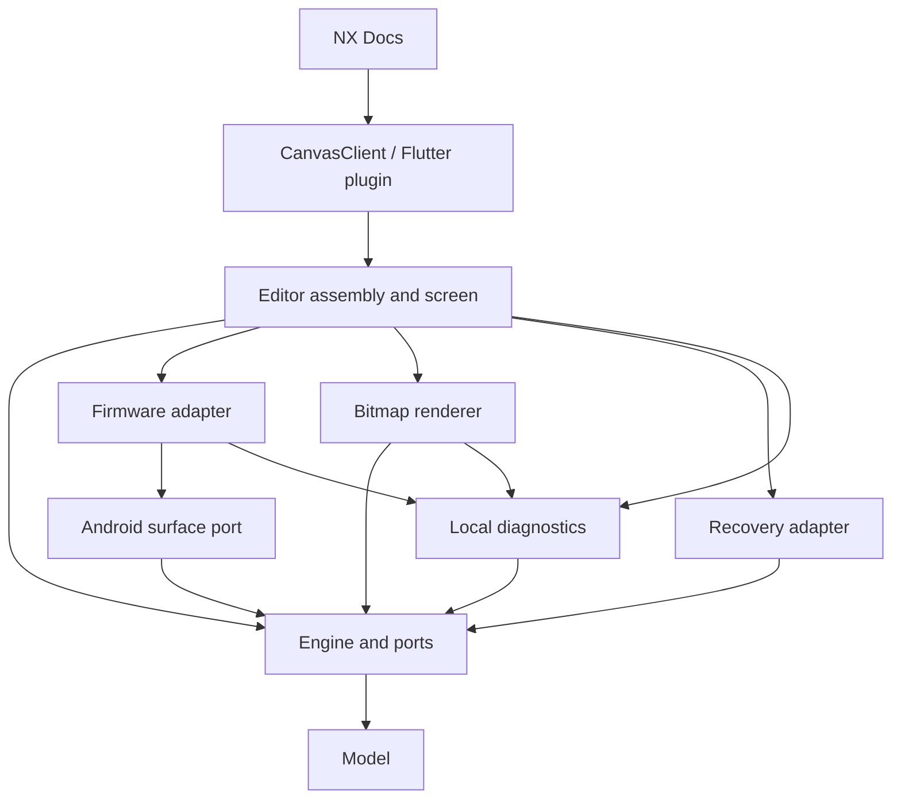

# NX Canvas architecture

NX Canvas owns editing, hardware input, rendering, and local recovery. NX Docs
owns document blocks, account/domain policy, document persistence, and server sync.
The integration boundary is `CanvasClient`, not an Android Activity or file path.

## Packages and libraries

| Location | Responsibility | Public boundary |
| --- | --- | --- |
| `../nx_canvas_model/lib/drawing.dart` | Pure Dart format and geometry; no Flutter dependency | Drawing values and version-1 codec |
| `lib/canvas_client.dart` | Typed host API and Flutter transport implementation | `CanvasClient`, `CanvasOpenRequest`, `CanvasSavedDrawing` |
| `lib/preview.dart` | Portable Flutter drawing preview | Preview widget/painter |
| `android/model` | Kotlin drawing values, geometry, board coordinates, codec | `InkSnapshot`, model values |
| `android/engine` | Editing state/history, ordered imports, action draining, rendering and save orchestration | `CanvasEngine`, commands, coordinators, ports |
| `android/platform` | Android surface types at the hardware boundary | `AndroidCanvasInput` |
| `android/firmware` | Firmware reflection, input record identity and decoding | `TabletInputAdapter` implementing the input port |
| `android/rendering` | Shared ink painter, spatial index, tiles and bitmap implementation | `BitmapCanvasRenderer` and `DefaultOverviewRenderer` implementing renderer ports |
| `android/recovery` | Existing checksummed journal and Android file/handoff adapter | `CanvasRecoveryStore`, `CanvasRepository` |
| `android/diagnostics` | Local rotating logs, watchdog and frame/memory samples | `DiagnosticSink` implementation |
| `android/editor` | Screen layout/gestures, lifecycle, dependency assembly | Thin `NativeEditorActivity`, `CanvasEditorScreen`, `CanvasSessionResources` |
| `android/src` | Flutter plugin registration, lifecycle and method transport | `NxCanvasPlugin` |
| `android/validation` | Separate device app with isolated storage | Tablet integration suite |

The Android directories are independently compiled Gradle libraries, not source
folders injected into Docs. Model and engine production code has no Android,
Flutter, filesystem, firmware, or Docs dependency. Their unit tests run on the JVM
without a tablet. They currently use the repository's Android library build tooling
for a common Kotlin/Java toolchain; that does not introduce platform code into them.

`nx_canvas_core` remains the Flutter package name for import compatibility.
`drawing.dart` re-exports the new pure Dart model package. Existing saved drawing
JSON and journal files retain their format, names, and acknowledgement semantics.

## Dependency direction



`test/architecture_test.dart` checks the allowed dependency graph, bans platform
imports from model/engine, confines vendor reflection, and prevents Docs from
reintroducing source-set inclusion or raw channel calls in its canvas session.

## State and threading contracts

- `CanvasEngine` owns mutable drawing/history and checks its owner thread. UI
  changes are typed `CanvasCommand`s. `presentation()` returns a detached model;
  views must not mutate it to change editor state. `snapshot()` gives workers a
  session/revision-tagged drawing. Published stroke lists/points are treated as
  immutable; adapters must not modify them after submission.
- `CanvasInputCoordinator` receives normalized input events. Vendor integer record
  types and reflective objects remain in firmware; decoded operations use
  `InkOperationKind`. Import work is serial, and completion returns to the owner
  before the next snapshot is taken. A failed import stays at the queue head and
  blocks later imports and destructive transitions. Explicit retry uses the retained
  record and its original coordinate transform; it never skips an erasure.
- `CanvasInputLifecycle` owns only tool requests and drain barriers, behind
  `CanvasFirmwarePort`. Raw events go directly from `RecordingNoteView.onInputTouch`
  to the stock firmware, with no packet queue, scheduler hop, replay or synthetic
  stroke boundaries. Closing admission refuses new contacts but lets an accepted
  stroke reach its real up. A transition waits for that up and worker completion
  before changing the pen or replacing the foreground. Mid-contact tool requests
  therefore take effect after the stroke, not by splitting it. Timeout retains the
  barrier and exposes retry without blocking the UI or discarding tracked ink.
  Expired callbacks cannot later fire a UI action. `setPen`, record reset, and
  foreground replacement remain confined to the adapter.
- `CanvasIdleUpdate` coalesces presentation-only status changes until 300 ms
  after contact ends. A new stroke cancels pending presentation work. Completed
  imports update history controls and the latest save label only; they do not
  repaint the toolbar or board labels. Journal writes and transition barriers
  do not depend on this timer. Destroy cancels it and stale callbacks are ignored.
- Native recovery checkpoints completed edits on the save worker while drawing.
  Docs does not poll, transfer or apply the drawing to AppFlowy while the canvas is
  open. It reconciles on return (or recovery after restart), persists the document,
  then acknowledges the exact recovery token. Server document sync consequently
  receives canvas edits after reconciliation, not during active handwriting.
- `CanvasActionGate` owns the one waiting action and its cancellable timer. It
  consults explicit `DrainResult` state. The existing 250 ms unresolved-pen timeout
  remains; import-only waits do not acquire that timeout. Timeout does not erase ink.
- `CanvasRenderCoordinator` owns one worker request, a replaceable latest request,
  the displayed frame, and a reusable spare. Frames are accepted only for the
  current session/revision and display mode. A displayed frame cannot become a
  worker's spare until a replacement is submitted. The screen detaches the surface
  before closing the coordinator; late results are disposed rather than displayed.
- `CanvasSaveCoordinator` owns save attempt ordering, UI acknowledgement filtering,
  retry cancellation, and the final FIFO durability barrier. Save failure never
  acknowledges recovery. Pending writes finish even after their UI is gone.
- `CanvasSessionResources` owns executors and the repository lease. Closing stops
  new input/actions and drains already accepted imports before releasing the lease.
  The Android scheduler executes owner-thread calls immediately, so capturing
  records during pause cannot enqueue them behind destruction.
- `CanvasRepository` is application-scoped because the OS creates the Activity
  separately from Flutter. It has a single FIFO disk executor and an explicit
  exclusive editor lease. It is not the owner of editing state. This version
  intentionally supports one active native editor and one retained recovery journal.

The process-level `CanvasServices` is the assembly/lookup point for OS entry points.
It holds the repository and default component factories. Engines and coordinators
never access that registry. It is not a general service locator for feature code.

## Extending or replacing a component

- To change hardware, implement `AndroidCanvasInput`, normalize records behind
  `CanvasInputRecord`, and select the input factory in `CanvasComponents`.
- To change rendering, implement `CanvasRenderer<BitmapCanvasFrame>` and select its
  factory. Keep frame ownership and revision filtering in the existing coordinator.
  Overview ink has its own `CanvasOverviewRenderer` port selected in the same
  component assembly; layout/hit testing remain in the view.
- To change persistence, implement `CanvasRecoveryStore` and inject it into the
  save coordinator. Keep host document persistence separate from stroke recovery.
- To add an editing operation, add a typed command and its engine test. Android
  controls only dispatch the command. A new UI control should not start a worker
  or write recovery files itself.
- To disable diagnostics, inject `NoCanvasDiagnostics`; engines/coordinators do not
  require logging. The standard plugin starts local Android diagnostics for the
  diagnostic build. No server upload is part of this architecture.

Factories and constructor injection provide compile-time replaceability. There is
no dynamic plugin loader, reflection-based service container, or event bus.
Optional components are wired at assembly rather than reaching into peer modules.

## Host flow and recovery compatibility

1. Docs persists the canvas/session identity in its document before opening.
2. `CanvasClient.open()` sends the versioned drawing and identity to the plugin.
3. The plugin prepares local input and launches the shared editor library.
4. Completed edits go to the local journal on the save worker. Docs leaves the
   native session alone while handwriting, then imports and persists its result
   on return before acknowledging the journal token.
5. Closing waits for durable local recovery. Docs saves the final drawing, then
   acknowledges that exact token. A failed host save leaves recovery intact.

The version-1 JSON fixture under `../nx_canvas_model/test/fixtures` is read by both
Dart and Kotlin tests. Journal restart/torn-write tests cover the existing binary
format. No database migration or server deployment is needed for this refactor.

## Verification

From the mobile repository root:

```sh
scripts/test_canvas_architecture.sh
```

For hardware integration, with the tablet connected:

```sh
cd nx_docs/android
./gradlew :canvas-validation:assembleDebug
adb install -r ../build/canvas-validation/outputs/apk/debug/canvas-validation-debug.apk
adb shell am instrument -w com.nexus.nx_canvas.validation/.CanvasInstrumentation
```

The device app has separate storage. It checks real firmware input and stroke
recovery, duplicate completion, navigation, raster equivalence across four rotations,
cache reuse, and watchdog capture. It does not draw into the user's Docs library.

The example app consumes the same plugin/editor. Its embedded `NativeInkView` is a
legacy experimental surface used only by the example, outside the production editor
path. Legacy example recovery methods remain available to avoid dropping old ink.

## Performance boundaries

Overview population and ink rasterization run on the session render worker.
`InkOverviewLayout` owns pure geometry and hit testing; `CanvasOverviewPreview`
prepares the bitmap through the replaceable renderer port. The view draws the
finished bitmap and board labels. `CanvasPreviewCoordinator` rejects results after
resize, dismissal or session close; unpublished bitmaps are recycled. Published
bitmaps are released by Android after the view drops its reference, avoiding a
race with RenderThread. There is at most one displayed preview per session.

`NativeTileRenderer` rasterizes tiles in panel orientation and composites them in
pixel coordinates. Rotation is part of the cache key, avoiding repeated bitmap
rotation/scaling during each pan. Four-rotation checks at multiple zoom levels
and fractional offsets protect alignment.

`InkInputProgress` tracks submitted firmware points and completed drawing batches.
A released, fully drained queue produces a watermark. `CanvasInputCoordinator`
reconciles unmatched starts only if that watermark covers the latest pen boundary;
accepted imports still block navigation until committed. Neither a timeout nor an
old stroke completion can clear a newer active stroke. Firmware implementations
that cannot establish quiescence remain conservatively blocked and observable.

Diagnostics remain local to the tablet. Preview population/raster/UI draw timings,
tile raster/composite timings and input watermarks distinguish CPU work from
firmware display latency without changing Docs persistence or server transport.

Firmware record decoding is type-specific: only `SimplePenRecord` supplies color;
`RubberRecord` and `RegionRubberRecord` inherit geometry from `BaseRecord` and
have no color field. Eraser operations use geometry only. Regression coverage
includes both real firmware eraser classes followed by saving and document return.
A decoding failure still blocks destructive transitions to protect unimported ink;
`firmware.decode_record` identifies the vendor class and type in local diagnostics.

## Eraser query preparation

`InkRegion` prepares the polygon once per operation. Immutable strokes cache their
bounds; a broad-phase test preserves untouched strokes by identity. Segment/edge
bounds reject unrelated intersection work before exact clipping, and containment
uses scalar arithmetic. Rub erasing uses the same stroke-bound rejection. No
simplification changes the polygon or stroke pressure. Differential tests compare
1,800 generated strokes with a frozen original clipping oracle, plus boundary,
concavity, dot, sparse-segment, rub, and undo tests.

Device validation exercises both orders of Android button and firmware down,
button release before up, repeated mid-stroke changes, toolbar region erase and
Document while firmware/import work is pending. It uses separate application data.
