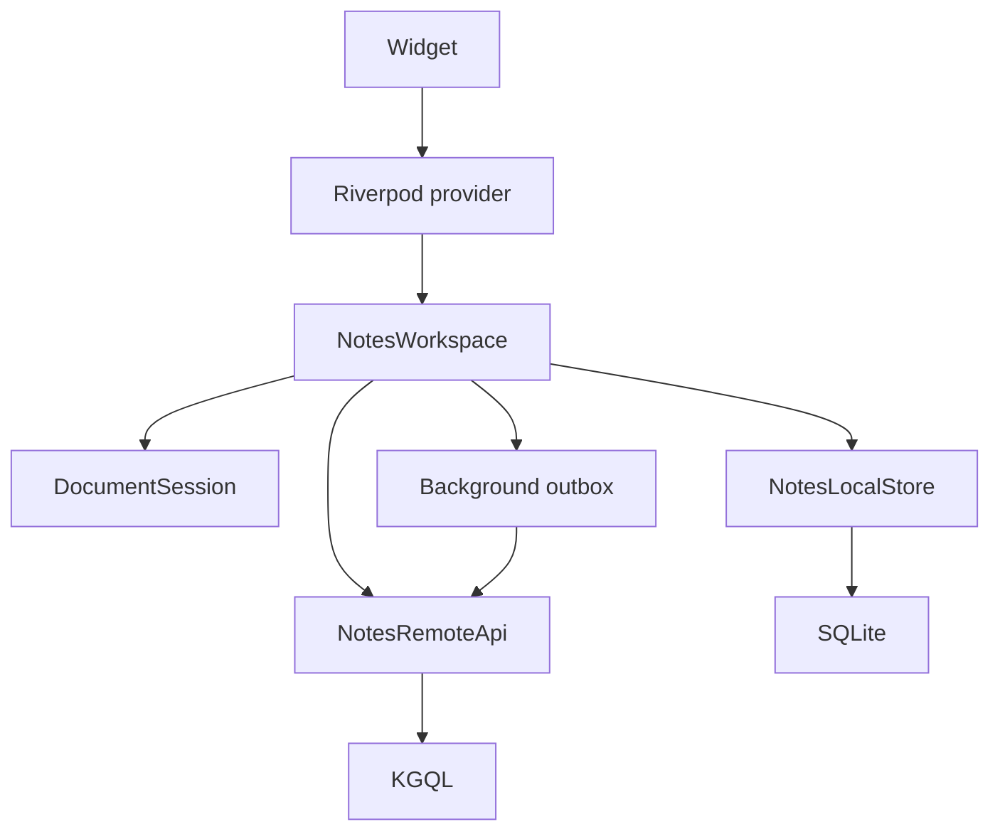

# nx_notes Refactor Plan

## Goal

Rebuild `nx_notes` around one simple rule:

> The native app reads and writes locally, refreshes a document when it is
> opened, and uploads pending edits in the background. The web app talks
> directly to KGQL.

The architecture should optimize first for human understanding, then for
modularity and independent testing. A new developer should be able to follow a
request from a widget to storage without discovering hidden provider
invalidation, platform checks spread through features, or competing sync
systems.

## Product requirements

### iOS and macOS

- Previously loaded documents must remain usable without internet access.
- Cached Recent and Books lists must appear immediately at startup.
- A cached current document must appear immediately when restored or opened.
- Startup must not wait for the complete document library to download.
- Catalog refreshes download summaries, not every full document body.
- Opening a cached document shows it immediately and then fetches the latest
  version from KGQL.
- Opening an uncached document fetches only that document.
- An uncached document opened while offline shows a clear unavailable message.
- Drafts are saved locally before any remote request.
- Pending drafts upload in the background.
- Remote saves use `updated_at` last-write-wins behavior.
- There is no continuous remote auto-update while a document remains open.

### Web

- Web is online-only.
- Web talks directly to KGQL.
- Web does not initialize SQLite, an outbox, or offline lifecycle services.
- The web editor still remains mounted during saves and refreshes.

### Accounts and endpoints

- Different users have isolated local data.
- LAN, WAN, and Tailscale are routes to the same database.
- Changing endpoint routes must not create a new account, cache, replica, or
  outbox.
- Local storage identity is based on the user, not the endpoint preset.

## Architectural principles

1. Native UI always renders local data first.
2. Network work never blocks the complete application shell.
3. Opening a document is an explicit action that triggers one remote refresh.
4. Editing persists to SQLite before attempting the network.
5. A document editor remains mounted until the user closes its route or tab.
6. Existing data and refresh status are represented separately.
7. Riverpod performs composition and exposes immutable UI state; it does not
   contain business logic.
8. Providers do not invalidate unrelated providers as a data propagation
   mechanism.
9. Domain and application code do not import Flutter, Riverpod, Drift, or
   KGQL.
10. Platform differences are selected in composition, not scattered through
    feature widgets.

## Architectural story



Every operation should be traceable through one direction:

```text
Widget
→ Riverpod controller
→ application service
→ local or remote interface
→ adapter
```

Repositories and services never reach back into Riverpod or widgets.

## Primary abstractions

Keep the number of important abstractions small. The main ones are
`NotesWorkspace`, `DocumentSession`, `NotesLocalStore`, and `NotesRemoteApi`.

### NotesWorkspace

`NotesWorkspace` is the main interface presented to the application:

```dart
abstract interface class NotesWorkspace {
  Stream<CatalogState> watchCatalog(CatalogQuery query);

  Future<void> refreshCatalog(CatalogQuery query);

  DocumentSession openDocument(int documentId);

  Future<NxDocument> createDocument({
    required DocumentKind kind,
    String? title,
  });

  Future<void> deleteDocument(int documentId);
}
```

Implementations:

- `NativeNotesWorkspace`
- `WebNotesWorkspace`
- `FakeNotesWorkspace`

`NativeNotesWorkspace` uses SQLite, KGQL, and a durable outbox.
`WebNotesWorkspace` uses KGQL directly. `FakeNotesWorkspace` supports
application and widget tests. Presentation code never checks the current
platform.

### DocumentSession

A `DocumentSession` represents one actually opened document:

```dart
abstract interface class DocumentSession {
  int get documentId;

  Stream<DocumentSessionState> get states;

  Future<void> saveDraft(NxDocument document);
  Future<void> refresh();
  Future<void> setPinned(bool pinned);
  Future<void> close();
}
```

Native session behavior:

```text
open
→ read SQLite
→ emit cached document
→ fetch the document from KGQL
→ compare updated_at
→ update SQLite and emit the latest document
```

Web session behavior:

```text
open
→ fetch the document from KGQL
→ emit the document
```

The session remains alive until the route or desktop tab closes.

### NotesLocalStore

Only native implementations use this interface:

```dart
abstract interface class NotesLocalStore {
  Stream<List<DocumentSummary>> watchCatalog(CatalogQuery query);
  Future<List<DocumentSummary>> readCatalog(CatalogQuery query);

  Future<LocalDocument?> readDocument(int documentId);
  Stream<LocalDocument?> watchDocument(int documentId);

  Future<void> replaceCatalog(
    CatalogQuery query,
    List<DocumentSummary> summaries,
  );

  Future<void> saveRemoteDocument(NxDocument document);

  Future<void> saveDraftAndEnqueue(
    NxDocument document,
    PendingDocumentSave mutation,
  );

  Future<List<PendingDocumentSave>> pendingSaves();
  Future<void> removePendingSave(int documentId);
}
```

SQLite and Drift details remain inside the adapter. Application and
presentation code never import Drift.

### NotesRemoteApi

This is the only interface whose production implementation understands KGQL:

```dart
abstract interface class NotesRemoteApi {
  Future<List<DocumentSummary>> fetchCatalog(CatalogQuery query);
  Future<NxDocument?> fetchDocument(int documentId);

  Future<RemoteSaveResult> saveDocumentIfNewer(
    NxDocument document,
  );

  Future<NxDocument> createDocument({
    required DocumentKind kind,
    String? title,
  });

  Future<void> deleteDocument(int documentId);
}
```

The KGQL adapter owns:

- KGQL queries and structs
- Model and attribute mapping
- GraphQL error mapping
- Endpoint selection
- The `saveDocumentIfNewer` mutation

### Supporting capabilities

Keep less frequently used capabilities separate instead of growing
`NotesWorkspace` into a large repository:

- `DocumentHistoryService` handles snapshots and restoration.
- `DocumentLinkService` handles projects and linked models.
- `DocumentPublishService` handles publishing and the mirror trigger.
- `DocumentAssetService` handles images and local assets.

## Domain features to preserve

The refactor must preserve:

- Documents and books
- Recent, pinned, search, and tag-filtered catalogs
- AppFlowy document content
- Tags and tag systems
- Linked models and projects
- Snapshots and restoration
- Publishing state
- Reading state and book rank
- Image assets
- Document result and navigation context
- Desktop tabs and in-tab navigation
- Mobile navigation
- Existing custom AppFlowy blocks, highlights, links, and editor tools

## Proposed source structure

```text
lib/
  domain/
    document/
      document.dart
      document_summary.dart
      document_publish.dart
      document_snapshot.dart
    catalog/
      catalog_query.dart
      catalog_state.dart
    tags/
      tag_system.dart
      tag_system_index.dart
    links/
      linked_model.dart
    sync/
      pending_document_save.dart
      remote_save_result.dart

  application/
    notes_workspace.dart
    document_session.dart
    native/
      native_notes_workspace.dart
      native_document_session.dart
      background_uploader.dart
    web/
      web_notes_workspace.dart
      web_document_session.dart
    history/
      document_history_service.dart
    links/
      document_link_service.dart
    publishing/
      document_publish_service.dart

  data/
    local/
      notes_local_store.dart
      drift/
    remote/
      notes_remote_api.dart
      kgql/
    assets/

  presentation/
    providers/
    editor/
    library/
    shell/
    settings/

  composition/
    notes_composition.dart
```

Dependencies move in one direction:

```text
presentation → application → domain
data adapters → application ports + domain
composition → everything
```

## Local database

Store document summaries separately from complete bodies:

```text
document_summaries
- user_id
- document_id
- model_type
- title
- pinned
- tags
- updated_at

document_bodies
- user_id
- document_id
- document_json
- plain_text
- updated_at
- dirty

catalog_memberships
- user_id
- catalog
- document_id
- position

pending_document_saves
- user_id
- document_id
- document_json
- updated_at
- retry_state

app_state
- user_id
- current_document_id
- navigation_state
```

Catalog membership allows the exact cached Recent, Books, and Pinned lists to
appear immediately. A Books refresh only downloads summary fields. Document
bodies are downloaded when opened.

Each user should preferably have a separate SQLite file. If one file is used,
every local table must include the user identity in its key.

## Native startup

Startup must not await network synchronization:

```text
1. Restore the user.
2. Open that user's SQLite database.
3. Construct NativeNotesWorkspace.
4. Display cached Recent.
5. Display cached Books.
6. Restore navigation or the current document when appropriate.
7. Start catalog refreshes in the background.
8. Start pending-save uploads in the background.
```

On a new installation:

- The shell opens immediately.
- Recent and Books display independent loading states.
- The entire application is not hidden behind one global spinner.
- Catalog summaries appear as their requests finish.

## Catalog state

Existing data and refresh state must be independent:

```dart
class CatalogState {
  const CatalogState({
    required this.items,
    required this.isInitialLoading,
    required this.isRefreshing,
    this.error,
  });

  final List<DocumentSummary> items;
  final bool isInitialLoading;
  final bool isRefreshing;
  final Object? error;
}
```

A refresh should look like:

```text
items=[cached books], refreshing=true
→ items=[latest books], refreshing=false
```

It must not look like:

```text
items=[]
→ loading
→ items=[latest books]
```

Catalog refreshes update summaries and catalog memberships. They do not fetch
full document bodies.

## Opening a document

Opening is triggered only by navigation:

```text
User selects openDocument(id)
→ Riverpod creates one DocumentSession for id
→ session reads the cached document
→ session requests that remote document once
```

Provider or widget rebuilds do not count as opening the document again.

### Cached and online

```text
Show the cache immediately
→ set isRefreshing=true
→ fetch the remote document
→ apply it only if newer
→ set isRefreshing=false
```

### Cached and offline

```text
Show the cache
→ remote request fails
→ retain the cache
→ display subtle offline status
```

### Uncached and online

```text
Show a document-level loading indicator
→ fetch only that document
→ save it to SQLite
→ initialize the editor
```

### Uncached and offline

Show a clear message that the document has not been downloaded on the device.

## Document session state

Do not represent the complete editor using `AsyncValue<NxDocument?>`.

```dart
enum DocumentPhase {
  opening,
  ready,
  unavailableOffline,
  notFound,
}

class DocumentSessionState {
  const DocumentSessionState({
    required this.phase,
    required this.document,
    required this.isRefreshing,
    required this.uploadState,
    this.error,
  });

  final DocumentPhase phase;
  final NxDocument? document;
  final bool isRefreshing;
  final UploadState uploadState;
  final Object? error;
}
```

Once the session becomes `ready`, background refresh or save activity cannot
return it to `opening`.

## Editor lifecycle

The Flutter editor controller is created once per `DocumentSession`.

Rules:

- Key the editor by document ID.
- Do not key it by content, revision, or timestamp.
- Do not replace it with a spinner during refresh.
- Apply remote content programmatically to the existing controller.
- Preserve selection and scroll position where possible.
- Suppress `onChanged` during initial and remote content application.
- Compare content hashes before applying remote content.
- Dispose only when the route or tab closes.

Change origins are explicit:

```dart
enum EditorChangeOrigin {
  user,
  initialLoad,
  remoteRefresh,
  snapshotRestore,
}
```

Only user-originated changes produce draft saves.

## Draft saving

The local save is the durability boundary:

```text
User edits
→ update the editor
→ debounce briefly
→ assign updated_at
→ save the document and outbox entry in one SQLite transaction
→ report locally saved
→ upload later
```

Do not wait for the remote debounce before protecting the draft locally.
SQLite persistence should happen quickly. Remote upload can use a longer
debounce.

Only the latest pending draft per document is required:

```text
pending_document_saves key = user_id + document_id
```

A newer local edit replaces the older unsent outbox payload. The saved
`updated_at` remains unchanged across retries.

## Server last-write-wins mutation

Add one atomic KGQL mutation:

```text
saveDocumentIfNewer(document, updated_at)
```

Server behavior:

```text
Lock the models row
→ compare incoming updated_at with models.updated_at
→ return STALE if incoming is not newer
→ otherwise apply the KGQL mutation
→ explicitly set models.updated_at to incoming updated_at
→ return APPLIED
```

The explicit `models.updated_at` update is required because document body
fields are stored as KGQL attributes and an attribute-only update may not
otherwise change the model row timestamp.

The comparison and update must happen in one PostgreSQL transaction.

## Background uploader

The uploader has one narrow responsibility:

```text
Read pending saves
→ call saveDocumentIfNewer
→ handle the response
```

### APPLIED

```text
Update local remote metadata
→ mark clean
→ remove the pending save
```

### STALE

```text
Remove the pending save
→ fetch the current remote document
→ replace the local document
```

### Network failure

```text
Keep the pending save
→ retry later
```

Run the uploader on:

- App launch
- App resume
- Connectivity recovery
- Manual refresh
- Shortly after a local edit

The uploader never downloads the complete document library.

## Riverpod design

Riverpod is limited to dependency construction, lifecycle, and immutable
presentation state.

### Dependency providers

```dart
currentUserProvider
notesLocalStoreProvider
notesRemoteApiProvider
notesWorkspaceProvider
backgroundUploaderProvider
```

### Feature providers

```dart
recentCatalogProvider
booksCatalogProvider
pinnedCatalogProvider
documentSessionProvider(documentId)
documentHistoryProvider(documentId)
```

### Provider rules

- Providers never mutate another provider's state.
- Do not use `ref.invalidate()` for normal data propagation.
- Saving a draft does not invalidate the document provider.
- Refreshing a catalog does not rebuild an editor session.
- Use `ref.watch()` for state displayed by a widget.
- Use `ref.read()` for commands.
- Business logic belongs in plain Dart application objects.
- Riverpod notifiers adapt application streams into UI state.
- Logout disposes the complete account-scoped provider container.
- A document-session family may use `autoDispose`, but the session remains
  watched for as long as its mobile route or desktop tab is mounted.

## Role of nx_offline

Keep `nx_offline`, but reduce and clarify its responsibility.

Reusable behavior:

- Durable outbox storage
- Retry scheduling
- Application lifecycle triggers
- Connectivity triggers
- Applied, stale, and retry result handling
- Account scoping
- Test utilities

`nx_offline` must not understand:

- Documents or books
- AppFlowy
- KGQL structs
- Catalogs
- Tags
- Publishing

`nx_notes` supplies the adapter that turns a pending document save into a
`saveDocumentIfNewer` call. This preserves reusable behavior without forcing
the complete application through a generic synchronization abstraction.

## Patterns to remove

The redesigned application must not carry forward:

- A global mutable `documentLocalCacheProvider`
- Provider invalidation after draft saving
- Full-library download during startup
- Timestamp-based full catalog scans as a sync engine
- Two competing offline engines
- Widgets reading KGQL repositories directly
- Application services depending on `Ref`
- Globally scoped providers owning editor debounce timers
- Editor lifecycle tied to a `FutureProvider`
- Endpoint presets participating in local cache identity

## Migration plan

The new design should be built beside the existing implementation and migrated
feature by feature. Avoid a single destructive rewrite.

### Phase 1: Freeze behavior

Write characterization tests for:

- Document mapping
- Publishing
- Tags
- Links
- Snapshots
- Reading state
- Editor custom blocks
- Desktop tabs and navigation
- Mobile navigation

These tests define which existing core behavior must survive.

### Phase 2: Add the server mutation

Implement and test `saveDocumentIfNewer`:

- Atomic comparison using `models.updated_at`
- Explicit `models.updated_at` update
- `APPLIED` and `STALE` results
- Concurrent mutation behavior
- Attribute-only document updates

Complete this before replacing the native uploader.

### Phase 3: Establish the domain

Create the new plain-Dart domain types and policies:

- `DocumentSummary`
- `CatalogQuery`
- `CatalogState`
- `DocumentSessionState`
- `PendingDocumentSave`
- `RemoteSaveResult`

Move existing useful behavior without changing semantics.

### Phase 4: Implement data interfaces

Build and contract-test:

- `DriftNotesLocalStore`
- `KgqlNotesRemoteApi`
- `MemoryNotesLocalStore`
- `FakeNotesRemoteApi`

Each interface receives a shared contract suite so fake and production
implementations behave consistently.

### Phase 5: Build native application services

Implement:

- `NativeNotesWorkspace`
- `NativeDocumentSession`
- `BackgroundUploader`

Test them using the memory store and fake remote API before connecting Flutter.

### Phase 6: Build Riverpod composition

Introduce the new provider tree beside the existing one.

Migrate in this order:

1. Recent catalog
2. Books catalog
3. One read-only document
4. Editable document session
5. Background draft saving

At the end of this phase, verify that autosave and refresh never dispose or
recreate the editor.

### Phase 7: Move secondary features

Migrate and test independently:

1. Create and delete
2. Pinning
3. Search and tag filtering
4. Links and projects
5. Snapshots and history
6. Publishing
7. Images
8. Reading state and book ranking

### Phase 8: Build the web implementation

Implement `WebNotesWorkspace` and `WebDocumentSession` using the same
presentation-facing interfaces with direct KGQL behavior.

Verify:

- No SQLite initialization
- No outbox
- No offline lifecycle
- No duplicate fetch on provider rebuild
- Stable editor during a remote save

### Phase 9: Remove legacy paths

After the native and web behavior is covered, delete:

- Old offline composition providers
- The old Notes sync engine
- Timestamp catalog pulling
- The global document cache
- Provider invalidation data paths
- Obsolete adapters and compatibility code

## Testing strategy

### Domain tests

Test value behavior and policies without Flutter:

- Document and summary mapping
- Publishing state
- Tag indexes
- Last-write-wins results
- Catalog queries

### Contract tests

Run shared suites against:

- Memory and Drift local stores
- Fake and KGQL remote APIs
- Native and web workspace behavior where applicable

### Application tests

Test plain-Dart services with fakes:

- Cached-first catalog startup
- Cached-first document opening
- One remote refresh per open
- Local save and outbox transaction
- Applied, stale, and retry upload paths
- User isolation

### Provider tests

Verify:

- Provider rebuilds do not reopen documents.
- Catalog refresh does not rebuild document sessions.
- Save commands do not invalidate read providers.
- Account disposal closes all account-scoped sessions.

### Widget tests

Verify:

- The editor controller identity remains stable during save and refresh.
- Autosave does not produce a dispose/init cycle.
- Programmatic content application does not trigger `onChanged`.
- Cached data remains visible during background refresh.

### Integration tests

Use real SQLite with a fake or test KGQL server:

- Cached offline restart
- Pending draft process restart
- Background retry after connectivity returns
- Stale laptop mutation replaced by newer remote content
- LAN/WAN/Tailscale switching with the same user cache

## Completion criteria

The redesign is complete when:

- iPhone opens offline with cached Recent and Books.
- macOS opens offline with cached documents.
- Startup UI appears before any network request completes.
- Books refresh downloads summaries only.
- A cached document opens immediately and refreshes once.
- An uncached online document loads without blocking the rest of the app.
- An uncached offline document shows a clear unavailable state.
- Autosave never disposes or recreates the editor.
- Remote refresh never triggers a user save.
- An old laptop draft is rejected after a newer iPhone save.
- A rejected draft is removed and current remote content replaces it.
- A network failure leaves the outbox intact.
- Relaunch retries the exact original `updated_at`.
- LAN/WAN/Tailscale switching preserves local data.
- Different users have isolated caches.
- Web never opens SQLite.
- Tags, links, history, publishing, images, reading state, and custom editor
  blocks continue to work.

## Central design decision

`DocumentSession`, not a fetch provider, owns an open document.

That stable session separates editor lifetime from cache writes, remote
refreshes, and provider rebuilds. `NotesWorkspace`, `NotesLocalStore`, and
`NotesRemoteApi` then give the application a small set of clean, independently
testable boundaries.
