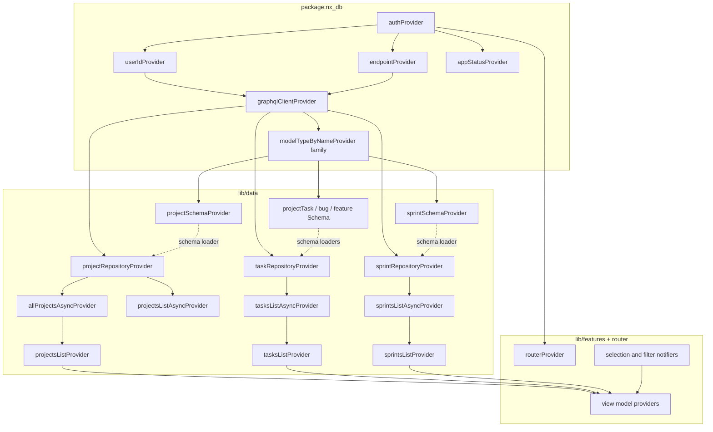

# `nx_projects` provider graph

Single reference for how Riverpod providers compose: auth, GraphQL, KGQL data, and UI state.

## Overview

- **State lives in Riverpod.** There is no parallel route-based data layer.
- **Upstream root** for network data is `authProvider` (from `package:nx_db/auth.dart` via `data/providers.dart` re-exports of `package:nx_db/riverpod.dart`). It drives:
  - **Routing** — `routerProvider` in [`lib/router.dart`](../lib/router.dart) (GoRouter redirect + `ref.listen` refresh).
  - **GraphQL** — `userIdProvider` and `endpointProvider` → `graphqlClientProvider` → repositories and schema.
- **Parallel UI state** (tabs, selection, filters) is held by `NotifierProvider`s. They do not depend on `authProvider` but feed view-model providers together with the list providers.

## Auth chain (package `nx_db`)

| Provider | File | Role |
|----------|------|------|
| `authProvider` | `nx_db` | `AsyncNotifier` — session restore, `login(userId, preset)`, `logout`, prefs |
| `userIdProvider` | `nx_db` | `String?` from `authProvider.value?.userId` |
| `endpointProvider` | `nx_db` | `String?` — `resolve(preset).graphqlHttp` when logged in |
| `appStatusProvider` | `nx_db` | `AppStatus` — initializing / authenticated / unauthenticated (optional for UI) |
| `graphqlClientProvider` | `nx_db` | Watches `userId` + `endpoint`. If either is `null` (not logged in), uses `GraphQLConfig` defaults — **app router should show `/login` before relying on that default for real data**. |

`ProjectsLoginScreen` calls `ref.read(authProvider.notifier).login(userId, preset)`.

## Data chain (this app)

### Schema (aliases over `modelTypeByNameProvider`)

| Provider | File |
|----------|------|
| `projectSchemaProvider` | [`lib/data/projects/project_schema_provider.dart`](../lib/data/projects/project_schema_provider.dart) |
| `projectTaskSchemaProvider`, `bugTaskSchemaProvider`, `featureTaskSchemaProvider` | [`lib/data/tasks/task_schema_provider.dart`](../lib/data/tasks/task_schema_provider.dart) |
| `sprintSchemaProvider` | [`lib/data/sprints/sprint_schema_provider.dart`](../lib/data/sprints/sprint_schema_provider.dart) |

`modelTypeByNameProvider` (in `nx_db`) **watches** `graphqlClientProvider`, so model-type fetches re-run when the client changes.

### Repositories (KGQL)

Defined in [`lib/data/providers.dart`](../lib/data/providers.dart):

| Line | Provider | Type | Key dependencies |
|------|----------|------|------------------|
| 24–28 | `projectRepositoryProvider` | `Provider<ProjectRepository>` | `ref.watch(graphqlClientProvider)`; `ref.read(projectSchemaProvider.future)` in loader |
| 32–38 | `taskRepositoryProvider` | `Provider<TaskRepository>` | `graphqlClient` + three task schema futures |
| 42–46 | `sprintRepositoryProvider` | `Provider<SprintRepository>` | `graphqlClient` + `sprintSchemaProvider.future` |

### Async list → sync snapshot

| Line | Provider | Type | Key dependencies |
|------|----------|------|------------------|
| 49–50 | `projectsListAsyncProvider` | `FutureProvider` | `ref.watch(projectRepositoryProvider).listRootProjects()` |
| 54–65 | `allProjectsAsyncProvider` | `FutureProvider` | `ref.watch(projectRepositoryProvider)` (roots + subprojects) |
| 68–69 | `tasksListAsyncProvider` | `FutureProvider` | `ref.watch(taskRepositoryProvider).listAll()` |
| 72–73 | `sprintsListAsyncProvider` | `FutureProvider` | `ref.watch(sprintRepositoryProvider).listSprints()` |
| 77–81 | `projectsListProvider` | `Provider` | `allProjectsAsyncProvider` → `data` or `[]` |
| 84–88 | `tasksListProvider` | `Provider` | `tasksListAsyncProvider` |
| 91–95 | `sprintsListProvider` | `Provider` | `sprintsListAsyncProvider` |

**Important:** any `FutureProvider` that calls the backend must `ref.watch` a repository (or the client) so it **re-executes** when auth switches the GraphQL endpoint. `allProjectsAsyncProvider` was fixed to use `ref.watch(projectRepositoryProvider)` instead of `read` so project rows do not stay pinned to a stale `GraphqlClient` after login.

## UI state (notifiers)

From [`lib/features/shell/selection_providers.dart`](../lib/features/shell/selection_providers.dart):

| Provider | Default | Meaning |
|----------|---------|---------|
| `mainTabIndexProvider` | `0` | 0 Projects, 1 Priority, 2 Sprint, 3 Daily |
| `selectedProjectIdProvider` | `null` | Mobile/desktop drill into project |
| `selectedSubProjectIdProvider` | `null` | Subproject drill |
| `selectedPriorityBucketProvider` | `null` | Priority list drill into bucket |
| `sprintIndexProvider` | `1` | Which sprint in list |
| `dailyDateProvider` | `kReferenceTodayYmd` | Daily tab date (seed string) |
| `desktopViewIndexProvider` | `0` | 0 Planner, 1 Sprint, 2 Today (desktop) |
| `desktopPlannerModeProvider` | `0` | 0 Projects, 1 Priority (planner left pane) |

**Desktop planner overlays** (no network dependency) — [`lib/features/desktop/desktop_task_drawer_state.dart`](../lib/features/desktop/desktop_task_drawer_state.dart):

| Provider | Type | Meaning |
|----------|------|---------|
| `desktopTaskDrawerProvider` | `NotifierProvider<DesktopTaskDrawer, DesktopTaskDrawerState>` | Right-side panel: closed, viewing a task id, editing a `Task`, creating a task (defaults from selection), or creating a project |

`DesktopTaskDrawer` methods: `viewTask`, `editTask`, `newTask`, `newProject`, `close`. Rendered in [`lib/features/desktop/views/planner_view.dart`](../lib/features/desktop/views/planner_view.dart) as a `Stack` layer with [`ReferenceSideDrawer`](../lib/features/desktop/widgets/reference_side_drawer.dart). Task rows on desktop call `viewTask` from [`desktop_projects_body.dart`](../lib/features/projects/desktop_projects_body.dart) and [`desktop_priority_body.dart`](../lib/features/priority/desktop_priority_body.dart). Mobile continues to use bottom sheets for add/edit.

From [`lib/features/filters/filter_state_providers.dart`](../lib/features/filters/filter_state_providers.dart):

| Provider | Default |
|----------|---------|
| `filterKindProvider` | `'all'` |
| `filterStatusProvider` | `'all'` |
| `searchQueryProvider` | `''` |

## View-model providers (derived)

- **Projects** — [`lib/features/projects/projects_view_model.dart`](../lib/features/projects/projects_view_model.dart): `projectListRowsProvider`, `projectDetailTasksProvider` (family), `subProjectListRowsProvider` (family), `subProjectTasksProvider` (family) — input from `projectsListProvider`, `tasksListProvider`, search/filters.
- **Sprint** — [`lib/features/sprint/sprint_view_model.dart`](../lib/features/sprint/sprint_view_model.dart): `currentSprintProvider`, `sprintTasksProvider`, counts, `sprintDaySlicesProvider`, `sprintHeaderStatsProvider`.
- **Daily** — [`lib/features/daily/daily_view_model.dart`](../lib/features/daily/daily_view_model.dart): `dailyTasksProvider`, `dailyHeaderStatsProvider`.
- **Priority** — [`lib/features/priority/priority_view_model.dart`](../lib/features/priority/priority_view_model.dart): `priorityBucketsProvider`, `priorityBucketTasksProvider` (family).

## Mermaid: dependency graph

## Routing and login

- [`lib/router.dart`](../lib/router.dart) defines:
  - `ref.listen(authProvider, …)` on a `ValueNotifier` so GoRouter re-evaluates `redirect` when auth changes.
  - `redirect`: unauthenticated and path ≠ `/login` → `/login`; authenticated and path `/` → (stay); authenticated on `/login` → `/`.
  - Routes: `/login` → `ProjectsLoginScreen`, `/` → `NxRootShell` (mobile vs desktop from `isDesktopLayoutWidth`).

## `watch` vs `read` rule of thumb

- **Inside another provider’s `build` callback, or a widget `build`:** use **`ref.watch`** for anything that can change and should trigger a rebuild: `authProvider` (or derived), `graphqlClientProvider`, `*RepositoryProvider`, `*ListProvider`, `*AsyncProvider`, notifiers the UI depends on.
- **Use `ref.read`** for one-off actions: `ref.read(authProvider.notifier).login(…)`, `ref.read(someProvider.notifier).setTab(…)`, or calling a repository method inside an `onPressed` / `onSubmit` after you already have a current repository instance.
- **Anti-pattern:** `ref.read(projectRepositoryProvider)` (or any repository) inside a `FutureProvider` that should re-run when the user logs in or the client is recreated — use `ref.watch(projectRepositoryProvider)` (see `allProjectsAsyncProvider` in `providers.dart`).

Repository factories correctly use `ref.read(*SchemaProvider.future)` in a **loader closure**; the repository object is still recreated when `graphqlClientProvider` is watched, which triggers new schema loads when `listRootProjects` / `listAll` run.

## Testing

- [`test/_support/seed_test_overrides.dart`](../test/_support/seed_test_overrides.dart) overrides:
  - `authProvider` → `ProjectsAuthController` (fixed user + localhost preset, no real login).
  - `allProjectsAsyncProvider`, `tasksListAsyncProvider`, `sprintsListAsyncProvider` → in-memory seed data.
- [`test/_support/integration_auth.dart`](../test/_support/integration_auth.dart) can override `auth` + URL providers for live backend tests.
- **Widget / unit tests** should use `ProviderScope(overrides: …)` and never expect the real login screen unless testing auth explicitly.

## Related docs

- App architecture (dual shell, reference alignment): [`arch.md`](arch.md)
- `nx_db` re-exports: `package:nx_db/riverpod.dart` re-exported from `data/providers.dart`
