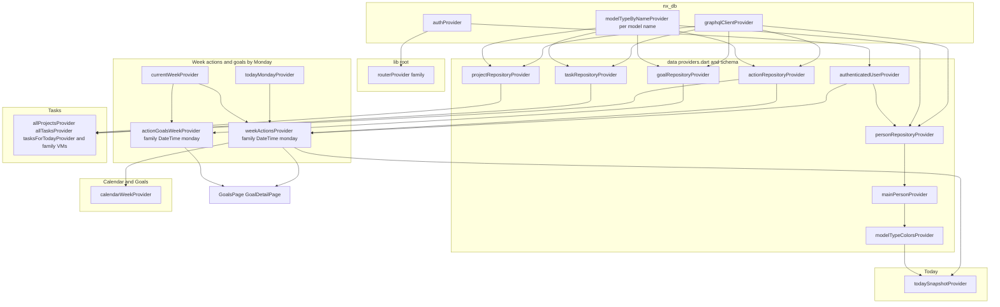
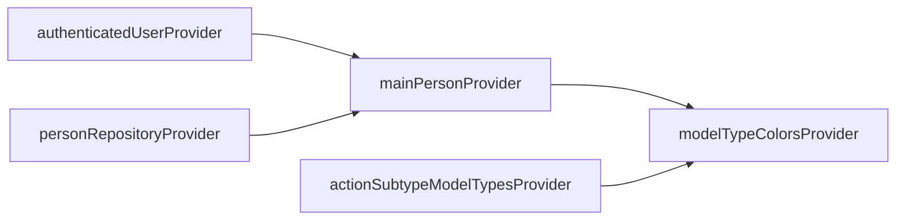
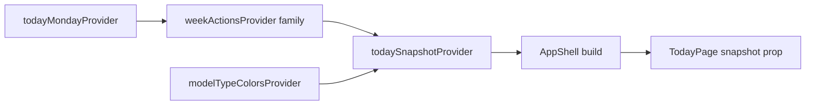
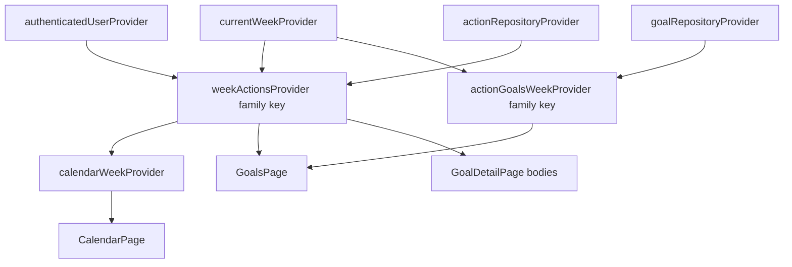
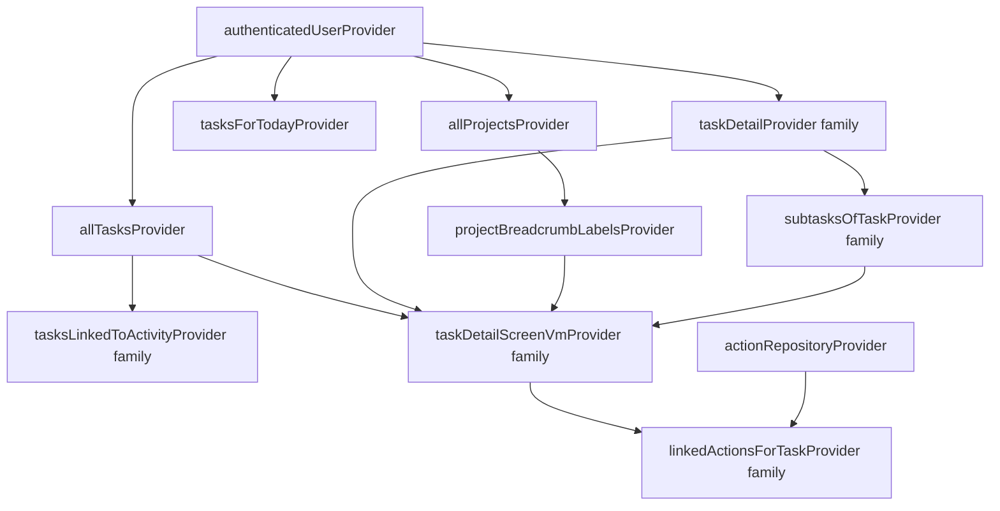

# `nx_time` Riverpod provider map

This doc is the **dependency + consumer map** for every Riverpod
provider in `lib/data/` and `lib/features/`. It complements
[`arch.md`](./arch.md) (layering and folder rules). **Feature-local
`widgets/` folders are not listed here** — they are presentational; only
`ConsumerWidget` / `ConsumerStatefulWidget` **pages** and
**`ref.watch`-based providers** interact with Riverpod.

## Conventions

| Symbol | Meaning |
|--------|--------|
| `((node))` in diagrams | Opaque root from `package:nx_db` (not defined in `nx_time`) |
| `([node])` | Screen / page (watches or reads `Ref`) |
| `[node]` | `nx_time` provider |
| Solid arrow | Normal dependency via `ref.watch` / `ref.read` on another provider |
| Dashed `invalidate` | `ref.invalidate` from mutation handlers (not a provider dependency) |

**Layers (see [`arch.md`](./arch.md)):** `data/providers.dart` wires **repositories
and person/colors**; per-feature `*_view_model.dart` / `*_providers.dart` files
define **UI-facing `FutureProvider`s** that `features/` screens watch.

**External roots (from `nx_db`, not re-exported by `nx_time`):**

- `authProvider` — from `package:nx_db/auth.dart` (not defined in this app)
- `graphqlClientProvider` — `package:nx_db/riverpod.dart`
- `modelTypeByNameProvider(String name)` — returns a `FutureProvider<ModelType>`; each `*SchemaProvider` in `data/` is one such instance.

## Overview: roots to screens

High-level only — detailed graphs follow in the sections below.



**Week store:** `weekActionsProvider` and `actionGoalsWeekProvider` are **`FutureProvider.autoDispose.family`** keyed by **Monday** (`DateTime` at 00:00 local). The **Today** tab uses `weekActionsProvider(todayMondayProvider)`; **Calendar** and **Goals** use the same family with `currentWeekProvider` as the Monday. When the user is on the current calendar week, `todayMondayProvider` and `currentWeekProvider` match — both tabs share one cached week fetch.

## Auth, router, and `authenticatedUserProvider`

`routerProvider` listens to **`authProvider`** (not `authenticatedUserProvider`) to
rebuild `GoRouter` on login / logout. Data fetches that must not race
unauthenticated config await **`authenticatedUserProvider`**, which throws if
`authProvider` has resolved to a null user.

```mermaid
flowchart LR
  ((authProvider)) --> router["routerProvider family"]
  ((authProvider)) --> authed["authenticatedUserProvider"]
  authed --> mainPerson["mainPersonProvider"]
```

**Consumers:** [`NexusTimeApp`](../lib/app.dart) watches `routerProvider` ·
[`TimeLoginScreen`](../lib/features/auth/time_login_screen.dart) watches `authProvider` ·
[`NxAppMenuButton`](../lib/features/shell/nx_app_menu_button.dart) calls `authProvider.notifier.logout()`.

## Schemas, repositories, and action subtypes

Each `*SchemaProvider` is a `modelTypeByNameProvider('…')` instance (cached model
type tree from KGQL). Repositories take **`graphqlClientProvider`** and load
schema via `ref.read(*SchemaProvider.future)` inside `providers.dart` (not `Ref` on
the repository class itself).

```mermaid
flowchart TB
  ((graphqlClientProvider)) --> personRepo
  ((graphqlClientProvider)) --> actionRepo
  ((graphqlClientProvider)) --> taskRepo
  ((graphqlClientProvider)) --> projectRepo
  ((graphqlClientProvider)) --> goalRepo

  ((modelTypeByNameProvider)) --> actionSchema["actionSchemaProvider"]
  ((modelTypeByNameProvider)) --> personSchema["personSchemaProvider"]
  ((modelTypeByNameProvider)) --> taskSchema["taskSchemaProvider"]
  ((modelTypeByNameProvider)) --> projectSchema["projectSchemaProvider"]
  ((modelTypeByNameProvider)) --> goalSchema["goalSchemaProvider"]

  actionSchema --> asm["actionSubtypeModelTypesProvider"]
  actionSchema --> actionRepo
  asm --> mtc["modelTypeColorsProvider"]
  asm --> aso["actionSubtypeOptionsProvider"]

  personSchema --> personRepo
  taskSchema --> taskRepo
  projectSchema --> projectRepo
  goalSchema --> goalRepo
```

**Domain-shaped subtype list (no `ModelType` in features):** `actionSubtypeOptionsProvider`
maps from `actionSubtypeModelTypesProvider`.

**`kgqlActionSchemaRepositoryProvider`:** thin `Ref` wrapper over `actionSchemaProvider`;
**only referenced in tests** today ([`test/data/schema/kgql_action_schema_repository_test.dart`](../test/data/schema/kgql_action_schema_repository_test.dart)).

**Person and colors chain:**



`modelTypeColorsProvider` awaits **`actionSubtypeModelTypesProvider`** so default colors
line up with known action subtypes.

## Today tab

| Piece | Role |
|-------|------|
| `todayMondayProvider` | `Provider<DateTime>`: Monday 00:00 of the current week (from `DateTime.now()` on first read). Drives which **family key** the Today tab uses. |
| `weekActionsProvider(monday)` | One `listForWeek` + per-day bucketing; `byDay[i]` is Mon=0 … Sun=6. |
| `todaySnapshotProvider` | `Provider<AsyncValue<TodaySnapshot>>` — watches **`weekActionsProvider(todayMondayProvider)`** and maps with **`AsyncValue.when`**; uses **`modelTypeColorsOrFallback(modelTypeColorsProvider)`**; takes **`byDay[todayDowIndex]`** and runs **`buildTodaySnapshot`**. On week refresh, Riverpod’s default **`skipLoadingOnRefresh: true`** keeps the previous **data** in **`AsyncValue.when`** (same idea as the calendar week VM). |

Color changes must **not** re-fetch actions: they only re-run the snapshot build with new colors, not **`listForWeek`**.



**`TodayPage` is a `StatelessWidget`** — it receives `TodaySnapshot` from
[`AppShell`](../lib/features/shell/app_shell.dart), which `ref.watch`es
`todaySnapshotProvider` (an **`AsyncValue`**) and uses **`modelTypeColorsOrFallback`**
on `modelTypeColorsProvider` for detail navigation colors.

## Calendar and Goals (shared `currentWeekProvider`)

`currentWeekProvider` is a **`NotifierProvider<CurrentWeek, DateTime>`** — the
Monday 00:00 of the week shown in the calendar and used for the Goals list.



- **`calendarWeekProvider`** — watches **`weekActionsProvider(currentWeekProvider)`** and maps to seven `CalendarDayData` (fold via `foldDayActions`).
- **`weekActionsProvider`** does not await **`modelTypeColorsProvider`**; the calendar page reads colors at paint time.
- **Goals** — `GoalsPage` watches **`actionGoalsWeekProvider(monday)`** and **`weekActionsProvider(monday)`** (same `monday` from `currentWeekProvider`). **Goal detail** embedded widgets watch the same `weekActionsProvider` + `currentWeek` for charts.

**`GoalDetailPage` / `GoalEditPage`:** also **`ref.read` `goalRepositoryProvider`** for loads/saves; `GoalEditPage` watches **`goalActionTypeOptionsProvider`**.

**Mutation helper:** [`invalidateActionsAfterMutation`](../lib/features/calendar/calendar_providers.dart) — `ref.invalidate(weekActionsProvider); ref.invalidate(actionGoalsWeekProvider);` (family-wide: every **mounted** Monday instance refetches, typically Today’s week and the visible calendar week).

## Tasks: projects, task list, detail, pickers, browse, drill

Core **`FutureProvider`s in [`task_view_models.dart`](../lib/features/tasks/task_view_models.dart):**



**[`project_drill_view_model.dart`](../lib/features/tasks/project_drill_view_model.dart):** family
providers (`projectByIdProvider`, `subProjectsProvider`, `tasksInProjectProvider`,
`breadcrumbForProjectProvider`) depend on `allTasksProvider` / `allProjectsProvider` and
`projectRepositoryProvider` as appropriate.

**[`projects_browse_view_model.dart`](../lib/features/tasks/projects_browse_view_model.dart):**
`projectBrowseRowsProvider` → `allProjectsProvider` + `allTasksProvider`.

**[`task_picker_view_model.dart`](../lib/features/tasks/task_picker_view_model.dart):**
`pickerUnfinishedYesterdayProvider`, `pickerRecentTasksProvider` → `taskRepositoryProvider`.

| Screen / page | Watches / reads (primary) |
|---------------|---------------------------|
| [`TasksPage`](../lib/features/tasks/tasks_page.dart) | `tasksForTodayProvider`, `projectBreadcrumbLabelsProvider` |
| [`TaskDetailPage`](../lib/features/tasks/task_detail_page.dart) | `taskDetailProvider`, `taskDetailScreenVmProvider`, `subtasksOfTaskProvider` · `modelTypeColorsProvider` (linked activity lines) |
| [`TaskEditPage`](../lib/features/tasks/task_edit_page.dart) | `taskDetailProvider`, `projectBreadcrumbLabelsProvider` |
| [`TaskCreatePage`](../lib/features/tasks/task_create_page.dart) | `taskSchemaProvider.future` (read), `projectBreadcrumbLabelsProvider` |
| [`TaskPickerPage`](../lib/features/tasks/task_picker_page.dart) | `pickerUnfinishedYesterdayProvider`, `pickerRecentTasksProvider`, `projectBreadcrumbLabelsProvider` |
| [`ProjectsBrowsePage`](../lib/features/tasks/projects_browse_page.dart) | `projectBrowseRowsProvider` |
| [`ProjectDrillPage`](../lib/features/tasks/project_drill_page.dart) | `projectByIdProvider`, `subProjectsProvider`, `tasksInProjectProvider`, `breadcrumbForProjectProvider` |

**[`ActivityDetailPage`](../lib/features/action_detail/action_detail_page.dart)** (not under `tasks/`) watches **`tasksLinkedToActivityProvider`**
and **`modelTypeColorsProvider`**.

## Action create, edit, and child actions

| Provider | Defined in | Consumed by |
|----------|------------|-------------|
| `actionCategoryOptionsProvider` | [`action_edit_providers.dart`](../lib/features/action_edit/action_edit_providers.dart) | [`ActionEditPage`](../lib/features/action_edit/action_edit_page.dart) (read `.future` / watch) |
| `parentActionForChildrenProvider` (family) | [`add_child_actions_view_model.dart`](../lib/features/action_create/add_child_actions_view_model.dart) | [`AddChildActionsPage`](../lib/features/action_create/add_child_actions_page.dart) |

`actionCategoryOptionsProvider` combines **`actionSubtypeModelTypesProvider`** with
**`modelTypeColorsProvider`** (via `modelTypeColorsOrFallback`).

**Typical save paths:** `ActionEditPage` and related flows call **`invalidateActionsAfterMutation`**
and invalidate task lists (`tasksForTodayProvider`, `allTasksProvider`) when links or
task rows change. See the cheat-sheet below.

## Goals: type picker (edit form)

`goalActionTypeOptionsProvider` in [`goal_edit_providers.dart`](../lib/features/goals/goal_edit/goal_edit_providers.dart) maps
**`actionSubtypeModelTypesProvider`** to `GoalActionTypeOption` for **`GoalEditPage`**.

## Settings: action colors

[`ActionColorsPage`](../lib/features/settings/action_colors_page.dart) watches
**`actionSubtypeOptionsProvider`**, **`modelTypeColorsProvider`**, **`mainPersonProvider`**;
it **`ref.read` `personRepositoryProvider`** to persist and **`invalidate` `mainPersonProvider`**
after writes (so **`modelTypeColorsProvider`** chain refreshes).

## Invalidation cheat-sheet

- **Action create / update / delete (e.g. `ActionEditPage`, `AddChildActionsPage`, `GoalEditPage` goal mutations):**  
  [`invalidateActionsAfterMutation`](../lib/features/calendar/calendar_providers.dart)  
  (invalidates the **`weekActionsProvider`** and **`actionGoalsWeekProvider`** families).  
  Also **`tasksForTodayProvider`** + **`allTasksProvider`** when task links or task lists
  change. **`parentActionForChildrenProvider`** when parent/child relations change.
- **Task create / update / done toggle:** `taskDetail*`, `subtasksOfTaskProvider`,
  `taskDetailScreenVmProvider`, `linkedActionsForTaskProvider` families as
  needed · `tasksForTodayProvider` · `allTasksProvider` · `projectBreadcrumbLabelsProvider`
  when project label changes.
- **Person `preference` (colors):** `mainPersonProvider` invalidation (cascades to
  `modelTypeColorsProvider`).

## Provider reference table

Sort order: **alphabetical by provider name.** *Family* = `FutureProvider.family` /
`Provider.family` with a parameter. **External** = defined in `package:nx_db`, not
in `lib/`.

| Provider | Type | Defined in | Depends on (direct) | Consumed by |
|----------|------|------------|----------------------|-------------|
| `actionCategoryOptionsProvider` | `FutureProvider` | [`action_edit_providers.dart`](../lib/features/action_edit/action_edit_providers.dart) | `actionSubtypeModelTypesProvider`, `modelTypeColorsProvider` (watch) | `ActionEditPage` |
| `actionGoalsWeekProvider` | *family* `FutureProvider` `autoDispose` | [`calendar_providers.dart`](../lib/features/calendar/calendar_providers.dart) | `goalRepositoryProvider` (watch); arg: Monday | `GoalsPage`, `GoalDetailPage` (family arg from `currentWeekProvider`) |
| `actionRepositoryProvider` | `Provider<ActionRepository>` | [`providers.dart`](../lib/data/providers.dart) | `graphqlClientProvider`, `actionSchemaProvider` (read `.future` in constructor closure) | Many feature providers (see other rows) |
| `actionSchemaProvider` | `FutureProvider<ModelType>` (via `modelTypeByNameProvider`) | [`action_schema_provider.dart`](../lib/data/action/action_schema_provider.dart) | `modelTypeByNameProvider` (nx_db) | `actionRepositoryProvider`, `actionSubtypeModelTypesProvider`, `kgqlActionSchemaRepositoryProvider` (tests) |
| `actionSubtypeModelTypesProvider` | `FutureProvider` | [`action_subtypes_provider.dart`](../lib/data/action/action_subtypes_provider.dart) | `actionSchemaProvider` | `actionSubtypeOptionsProvider`, `modelTypeColorsProvider`, `goalActionTypeOptionsProvider`, `actionCategoryOptionsProvider` |
| `actionSubtypeOptionsProvider` | `FutureProvider` | [`action_subtypes_provider.dart`](../lib/data/action/action_subtypes_provider.dart) | `actionSubtypeModelTypesProvider` | `ActionColorsPage` (settings) |
| `allProjectsProvider` | `FutureProvider` | [`task_view_models.dart`](../lib/features/tasks/task_view_models.dart) | `authenticatedUserProvider`, `projectRepositoryProvider` (read) | `projectBreadcrumbLabelsProvider`, `projectBrowseRowsProvider`, `breadcrumbForProjectProvider` |
| `allTasksProvider` | `FutureProvider` | [`task_view_models.dart`](../lib/features/tasks/task_view_models.dart) | `authenticatedUserProvider`, `taskRepositoryProvider` (read) | `tasksLinkedToActivityProvider`, `taskDetailScreenVmProvider` chain, `projectBrowseRowsProvider`, `tasksInProjectProvider` |
| `authenticatedUserProvider` | `FutureProvider<User>` | [`providers.dart`](../lib/data/providers.dart) | `authProvider` (nx_db) | Most `FutureProvider`s that hit KGQL after login |
| `breadcrumbForProjectProvider` | *family* | [`project_drill_view_model.dart`](../lib/features/tasks/project_drill_view_model.dart) | `allProjectsProvider` | `ProjectDrillPage` |
| `calendarWeekProvider` | `Provider<AsyncValue<...>>` | [`calendar_view_model.dart`](../lib/features/calendar/calendar_view_model.dart) | `currentWeekProvider`, `weekActionsProvider` (family) | `CalendarPage` |
| `currentWeekProvider` | `NotifierProvider` | [`calendar_providers.dart`](../lib/features/calendar/calendar_providers.dart) | (none) | `calendarWeekProvider`, family args for Calendar/Goals, `GoalDetailPage` (read) |
| `goalActionTypeOptionsProvider` | `FutureProvider` | [`goal_edit_providers.dart`](../lib/features/goals/goal_edit/goal_edit_providers.dart) | `actionSubtypeModelTypesProvider` | `GoalEditPage` |
| `goalRepositoryProvider` | `Provider<GoalRepository>` | [`providers.dart`](../lib/data/providers.dart) | `graphqlClientProvider`, `goalSchemaProvider` | `actionGoalsWeekProvider` (family) · `GoalDetailPage` / `GoalEditPage` (read) |
| `goalSchemaProvider` | `FutureProvider<ModelType>` (via `modelTypeByNameProvider`) | [`goal_schema_provider.dart`](../lib/data/goals/goal_schema_provider.dart) | `modelTypeByNameProvider` (nx_db) | `goalRepositoryProvider` |
| `kgqlActionSchemaRepositoryProvider` | `Provider<KgqlActionSchemaRepository>` | [`providers.dart`](../lib/data/providers.dart) | `Ref` (uses `actionSchemaProvider` inside repo) | **Tests only** |
| `linkedActionsForTaskProvider` | *family* | [`task_detail_view_model.dart`](../lib/features/tasks/task_detail_view_model.dart) | `authenticatedUserProvider`, `taskDetailProvider` (family), `actionRepositoryProvider` (read) | `taskDetailScreenVmProvider` |
| `mainPersonProvider` | `FutureProvider<Person?>` | [`providers.dart`](../lib/data/providers.dart) | `authenticatedUserProvider`, `personRepositoryProvider` (read `.getMain()`) | `modelTypeColorsProvider` · `ActionColorsPage` |
| `modelTypeColorsProvider` | `FutureProvider<ModelTypeColors>` | [`providers.dart`](../lib/data/providers.dart) | `mainPersonProvider`, `actionSubtypeModelTypesProvider` | `todaySnapshotProvider`, `actionCategoryOptionsProvider`, `AppShell`, `ActivityDetailPage`, `CalendarPage`, `AddChildActionsPage`, `TaskDetailPage`, `ActionColorsPage` |
| `parentActionForChildrenProvider` | *family* `autoDispose` | [`add_child_actions_view_model.dart`](../lib/features/action_create/add_child_actions_view_model.dart) | `actionRepositoryProvider` (read) | `AddChildActionsPage` |
| `personRepositoryProvider` | `Provider<PersonRepository>` | [`providers.dart`](../lib/data/providers.dart) | `graphqlClientProvider`, `personSchemaProvider` (read `.future`) | `mainPersonProvider` · `ActionColorsPage` (read for updates) |
| `personSchemaProvider` | `FutureProvider<ModelType>` (via `modelTypeByNameProvider`) | [`person_schema_provider.dart`](../lib/data/person/person_schema_provider.dart) | `modelTypeByNameProvider` (nx_db) | `personRepositoryProvider` |
| `pickerRecentTasksProvider` | `FutureProvider` | [`task_picker_view_model.dart`](../lib/features/tasks/task_picker_view_model.dart) | `authenticatedUserProvider`, `taskRepositoryProvider` (read `listAll`) | `TaskPickerPage` |
| `pickerUnfinishedYesterdayProvider` | `FutureProvider` | [`task_picker_view_model.dart`](../lib/features/task_picker_view_model.dart) | `authenticatedUserProvider`, `taskRepositoryProvider` (read) | `TaskPickerPage` |
| `projectBreadcrumbLabelsProvider` | `FutureProvider` | [`task_view_models.dart`](../lib/features/tasks/task_view_models.dart) | `allProjectsProvider` | `TasksPage`, `TaskDetailPage`, `TaskEditPage`, `TaskCreatePage`, `TaskPickerPage`, `taskDetailScreenVmProvider` |
| `projectBrowseRowsProvider` | `FutureProvider` | [`projects_browse_view_model.dart`](../lib/features/tasks/projects_browse_view_model.dart) | `authenticatedUserProvider`, `allProjectsProvider`, `allTasksProvider` | `ProjectsBrowsePage` |
| `projectByIdProvider` | *family* | [`project_drill_view_model.dart`](../lib/features/tasks/project_drill_view_model.dart) | `authenticatedUserProvider`, `projectRepositoryProvider` (read) | `subProjectsProvider` · `ProjectDrillPage` |
| `projectRepositoryProvider` | `Provider<ProjectRepository>` | [`providers.dart`](../lib/data/providers.dart) | `graphqlClientProvider`, `projectSchemaProvider` | `allProjectsProvider` · `project*Provider` in drill (see `project_drill_view_model.dart`) |
| `projectSchemaProvider` | `FutureProvider<ModelType>` (via `modelTypeByNameProvider`) | [`project_schema_provider.dart`](../lib/data/projects/project_schema_provider.dart) | `modelTypeByNameProvider` (nx_db) | `projectRepositoryProvider` |
| `routerProvider` | *family* `Provider<GoRouter>` | [`router.dart`](../lib/router.dart) | `authProvider` (listen + read) | `NexusTimeApp` |
| `subProjectsProvider` | *family* | [`project_drill_view_model.dart`](../lib/features/tasks/project_drill_view_model.dart) | `authenticatedUserProvider`, `projectByIdProvider` (family), `projectRepositoryProvider` (read) | `ProjectDrillPage` |
| `subtasksOfTaskProvider` | *family* | [`task_view_models.dart`](../lib/features/tasks/task_view_models.dart) | `authenticatedUserProvider`, `taskDetailProvider` (family), `taskRepositoryProvider` (read) | `TaskDetailPage`, `taskDetailScreenVmProvider` |
| `taskDetailProvider` | *family* | [`task_view_models.dart`](../lib/features/tasks/task_view_models.dart) | `authenticatedUserProvider`, `taskRepositoryProvider` (read) | `TaskDetailPage`, `TaskEditPage`, `subtasksOfTaskProvider`, `linkedActionsForTaskProvider`, `taskDetailScreenVmProvider` |
| `taskDetailScreenVmProvider` | *family* | [`task_detail_view_model.dart`](../lib/features/tasks/task_detail_view_model.dart) | `taskDetailProvider`, `projectBreadcrumbLabelsProvider`, `subtasksOfTaskProvider`, `linkedActionsForTaskProvider` (all family by taskId) | `TaskDetailPage` |
| `taskRepositoryProvider` | `Provider<TaskRepository>` | [`providers.dart`](../lib/data/providers.dart) | `graphqlClientProvider`, `taskSchemaProvider` | All task `FutureProvider`s in `task_*_view_model.dart` |
| `taskSchemaProvider` | `FutureProvider<ModelType>` (via `modelTypeByNameProvider`) | [`task_schema_provider.dart`](../lib/data/tasks/task_schema_provider.dart) | `modelTypeByNameProvider` (nx_db) | `taskRepositoryProvider` · `TaskCreatePage` (read `.future`) |
| `tasksForTodayProvider` | `FutureProvider` | [`task_view_models.dart`](../lib/features/tasks/task_view_models.dart) | `authenticatedUserProvider`, `taskRepositoryProvider` (read) | `TasksPage` |
| `tasksInProjectProvider` | *family* | [`project_drill_view_model.dart`](../lib/features/tasks/project_drill_view_model.dart) | `allTasksProvider` | `ProjectDrillPage` |
| `tasksLinkedToActivityProvider` | *family* | [`task_view_models.dart`](../lib/features/tasks/task_view_models.dart) | `allTasksProvider` | `ActivityDetailPage` |
| `todayMondayProvider` | `Provider<DateTime>` | [`calendar_providers.dart`](../lib/features/calendar/calendar_providers.dart) | (none) | `todaySnapshotProvider` (key into `weekActionsProvider` family) |
| `todaySnapshotProvider` | `Provider<AsyncValue<TodaySnapshot>>` | [`today_view_model.dart`](../lib/features/today/today_view_model.dart) | `todayMondayProvider`, `weekActionsProvider` (family), `modelTypeColorsProvider` (for `modelTypeColorsOrFallback`) | `AppShell` |
| `weekActionsProvider` | *family* `FutureProvider` `autoDispose` | [`calendar_providers.dart`](../lib/features/calendar/calendar_providers.dart) | `authenticatedUserProvider`, `actionRepositoryProvider`; arg: Monday | `todaySnapshotProvider`, `calendarWeekProvider`, `GoalsPage`, `GoalDetailPage` |

When you add a provider, add a row here and a node in the relevant section above.
