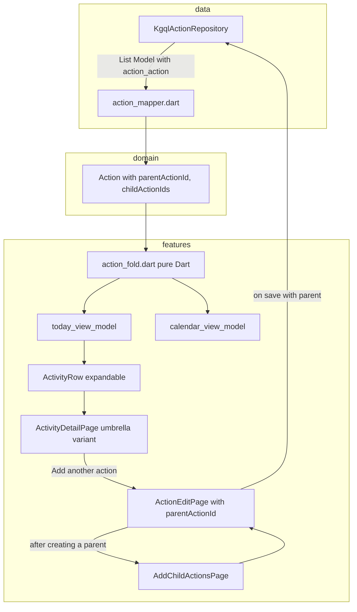

## Goal

Mirror in `mobile/nx_time/lib` the umbrella behavior already shown in `mobile/nx_time/reference/partials/{tab-today,page-activity-detail-umbrella,page-activity-detail-umbrella-coffee,page-add-trip-children}.html`, on top of the new generic `action_action` relation. Calendar reuses the same fold module so day columns collapse the same way.

Layering follows [mobile/nx_time/docs/arch.md](mobile/nx_time/docs/arch.md): pure-Dart domain, KGQL-only `data/`, Material/Riverpod `features/`.

## Data model decision

- Single parent per child in the UI/domain, even though the DB allows many. If the loaded child carries multiple `action_action` parents, the fold step picks the smallest `parent_id`.
- KGQL returns a flat list for the day; a pure-Dart fold builds the umbrella tree client-side.

## Generic rendering invariant

This is a hard rule for every file in this plan: **no behavior may branch on a concrete `Action` subtype name** (e.g. no `if modelTypeName == 'Goto'`, no allow-lists like `{Goto, Workout}`, no priority tables of `Sleep > Work > Workout > Meet > Consumption`). Rendering reads only:

- `Action.name` for the displayed title.
- `Action.modelTypeId` for color (via the existing `barColorForModelTypeId`).
- `Action.modelTypeName` for the pill label (whatever the DB returns, displayed verbatim).
- `Action.startTime` / `Action.endTime` for the time block.
- `Action.parentActionId` / `Action.childActionIds` for nesting.
- The user-controlled `actionCategoryOptionsProvider` list for the create-child chips.

The only literal type name allowed anywhere is `kActionRelationKey = 'Action'` (the abstract umbrella relation's struct key — not a concrete subtype). If a future requirement needs subtype-specific UI, it gets stored as a tag/attribute in the DB, not hard-coded in Dart.

## Architecture flow



## Domain layer

[lib/domain/action/action.dart](mobile/nx_time/lib/domain/action/action.dart)

- Add `int? parentActionId` and `List<int> childActionIds` (default `const []`) to `Action`. Update `==`, `hashCode`, `toString`. Pure Dart only.

[lib/domain/action/action_repository.dart](mobile/nx_time/lib/domain/action/action_repository.dart)

- Add two methods to `ActionRepository`:
  - `Future<int> linkChildAction({required int parentId, required int childId});`
  - `Future<void> unlinkChildAction({required int relationId});`
- (`childActionIds` are read on the existing `listForCalendarDay` / `getById` results; no new read method needed.)

## Data layer

[lib/data/action/action_attr_keys.dart](mobile/nx_time/lib/data/action/action_attr_keys.dart)

- Add `const String kActionRelationName = 'action_action';` and `const String kActionRelationKey = 'Action';` (the struct nesting key produced by `buildKgqlStructFromSchema` for the `Action -> Action` relation).

[lib/data/action/action_mapper.dart](mobile/nx_time/lib/data/action/action_mapper.dart)

- In `actionFromModel`, populate `childActionIds` from `m.relations?[kActionRelationKey]` (outgoing children) when present; fall back to filtering `m.relationsList` by `modelType == 'Action'` if the nested map is absent. `parentActionId` stays null at the mapper layer; it is set in the fold step using the day-set.
- New helper `setModelRequestForCreateWithParent(Action child, String modelTypeName, {required int parentActionId})` that emits the same payload as `setModelRequestForCreate` plus `relations: [ModelRelation(modelType: kActionRelationKey, link: [parentActionId])]`. Used by the post-save children flow.

[lib/data/action/kgql_action_repository.dart](mobile/nx_time/lib/data/action/kgql_action_repository.dart)

- Confirm via a small unit test that `buildKgqlStructFromSchema` on the abstract `Action` schema (after the DB now exposes the `action_action` self-relation) emits `struct['Action'] = {id: true, name: true}`. If that does not include enough, override with an explicit struct extension in the repo (only place that knows KGQL).
- Implement `linkChildAction` and `unlinkChildAction` against `set_kgql_models` using `ModelRelation` (parent's update payload with `relations: [ModelRelation(modelType: 'Action', link: [childId])]`, and `delete: true` by `id` for unlink).
- Plumb `create` to optionally take a `parentActionId` when called from the children flow.

[lib/data/providers.dart](mobile/nx_time/lib/data/providers.dart)

- No structural change; the existing `actionRepositoryProvider` picks up the new repo methods automatically.

## Feature: pure fold module

New `lib/features/today/action_fold.dart` (pure Dart, no Flutter / no Riverpod) — kept under `today/` because both Today and Calendar import it and Calendar already imports from `features/today/`.

No hard-coded category / title / color rules. Each row simply shows the parent (umbrella) action's own `name`, `modelTypeId` (color), `startTime`, and `endTime`. Children are surfaced verbatim.

```dart
class UmbrellaRow {
  final Action umbrella;
  final List<Action> children; // sorted by start_time, may be empty
}

List<UmbrellaRow> foldDayActions(List<Action> dayActions);
```

Algorithm (graph-only, no time-containment heuristic, no type allow-lists):

1. Build `byId` and `outgoingChildren[parent.id] -> [child.id...]` from each action's `childActionIds` filtered to ids present in the day-set.
2. For each parent with non-empty in-day children, mark each child's `parentActionId` (skip if already assigned, ties broken by smallest parent id) to keep the single-parent invariant.
3. Top-level rows = actions with `parentActionId == null`; their `children` = `outgoingChildren[id]` resolved through `byId` and sorted by `startTime`.
4. Return rows sorted by `umbrella.startTime`.

That is the entire policy — anything fancier (category priorities, place subtitles, "Goto wraps everything time-contained") stays out of the fold and out of the rendering layer. The user controls nesting explicitly via `action_action` edges.

Tests in [test/features/today/action_fold_test.dart](mobile/nx_time/test/features/today/action_fold_test.dart):

- Flat list with zero edges → N solo rows in start-time order.
- Parent with two children → one umbrella row with the children sorted; siblings stay siblings.
- Child with two parents → assigned to the smallest `parent_id`; the other parent's row does not list it.
- Children present in the day but parent absent → children render as solo top-level rows.

## Feature: Today list

[lib/features/today/today_view_model.dart](mobile/nx_time/lib/features/today/today_view_model.dart)

- Add `class TodayUmbrellaActivity extends TodayActivity` with `List<TodayActivity> children`, `int childCount`, plus the parent's `Action` reference. Keep existing `TodayActivity` for solo rows.
- `buildTodaySnapshot` now calls `foldDayActions(...)` first, then maps each `UmbrellaRow` into either a solo `TodayActivity` or a `TodayUmbrellaActivity`. Title is `umbrella.name`, color is `barColorForModelTypeId(umbrella.modelTypeId)` — same source of truth a solo row already uses; children are mapped the same way. `sourceActions` keeps a flat list aligned to the visible umbrellas (children indexed separately for navigation).
- `timeMapSegments` is built from one segment per umbrella row, so the bar matches the list. Each segment uses the umbrella's own color (not a derived umbrella category).

[lib/features/today/widgets/activity_row.dart](mobile/nx_time/lib/features/today/widgets/activity_row.dart)

- Convert `ActivityRow` to a `StatefulWidget` (or a `ConsumerStatefulWidget` if state needs lifting). Add a chevron button shown when the activity is a `TodayUmbrellaActivity`. Tapping the chevron toggles a local `_expanded` flag and animates the children list (matches `tab-today.html` lines 87-139). Tapping the row body still calls `onTap`.
- New private `_UmbrellaChildTile` widget (small rounded tile with a colored mini-bar, child name, time range, duration) used by the inline expanded list.

[lib/features/today/today_page.dart](mobile/nx_time/lib/features/today/today_page.dart)

- When iterating `snapshot.actions`, pass child taps through to a new `onChildTap(int rowIndex, int childIndex)` callback that opens the child's detail. The umbrella row body opens the umbrella detail page.

[lib/features/shell/app_shell.dart](mobile/nx_time/lib/features/shell/app_shell.dart) (only the Today tab wiring)

- Wire `onActivityTap` to `ActivityDetailPage(args: activityDetailArgsForUmbrella(umbrellaRow, snapshotTitleLine))` for umbrella rows; fall back to the existing single-action flow otherwise.

## Feature: Action detail (umbrella variant)

[lib/features/action_detail/action_detail_view_model.dart](mobile/nx_time/lib/features/action_detail/action_detail_view_model.dart)

- Add `ActivityDetailLayout.umbrella`. Extend `ActivityDetailArgs` with optional `List<UmbrellaChildItem> umbrellaChildren` (each carrying the child's name, color, time range, source `Action`) and a parent-`Action` reference so the "Add another action" button can pass it down. Place / people chip slots are kept as optional fields but not populated in this iteration (left null until `Place` / `Person` loaders land).
- New builder `ActivityDetailArgs activityDetailArgsForUmbrella(UmbrellaRow row, String snapshotTitleLine)`: title is `row.umbrella.name`, category pill label is the parent's `modelTypeName` (e.g. "Goto", "Workout"), pill colors come from `categoryPillStyleFromBarColor(barColorForModelTypeId(row.umbrella.modelTypeId))` — same path solo rows already use. Time block is the parent's interval. `umbrellaChildren` are mapped 1:1 from `row.children`.

[lib/features/action_detail/action_detail_page.dart](mobile/nx_time/lib/features/action_detail/action_detail_page.dart)

- The header keeps the existing "Action detail" label (no rename to "Trip detail").
- When `args.layout == ActivityDetailLayout.umbrella`, render a new `_ChildActionsSection` between the time block and the existing notes/tasks sections. It shows: a header "Child actions" with the count, the list of children (each tile uses the child's own color + name + time range and tapping it pushes the child's detail), and a dashed "Add another action" button that pushes `AddChildActionsPage(parent: args.sourceAction!)`.
- Reuse existing `TimeBlockBar`, `DetailCategoryPill`, `ActionDetailNotesBlock`.

## Feature: post-save children prompt

New folder `lib/features/action_create/`:

- [lib/features/action_create/add_child_actions_page.dart](mobile/nx_time/lib/features/action_create/add_child_actions_page.dart) — mirrors `page-add-trip-children.html` but reworded around "actions" instead of "trips". Header reads "Action saved", summary card shows the parent's name + time using its own color, prompt reads "Add a child action?" with chips drawn from `actionCategoryOptionsProvider` (one chip per concrete `Action` subtype available to the user — no hard-coded Meet/Work/Workout list). Below: "Child actions" list with Unlink buttons. Done button pops back. Each chip pushes `ActionEditPage(mode: ActionEditMode.create, parentActionId: parent.id, prefillStart: parent.start, prefillEnd: parent.end, prefillCategory: option)`.
- [lib/features/action_create/add_child_actions_view_model.dart](mobile/nx_time/lib/features/action_create/add_child_actions_view_model.dart) — thin Riverpod provider that loads the parent action's children (refetched when `todaySnapshotProvider` is invalidated). No category catalog of its own; defers to `actionCategoryOptionsProvider`.

[lib/features/action_edit/action_edit_page.dart](mobile/nx_time/lib/features/action_edit/action_edit_page.dart)

- Add optional constructor params `int? parentActionId`, `DateTime? prefillStart`, `DateTime? prefillEnd`, `ActionCategoryOption? prefillCategory`. In `initState` apply the pre-fills.
- In `_save` (create branch), if `widget.parentActionId != null`, route through `setModelRequestForCreateWithParent` so the child action is created and linked to its parent in one mutation, then pop back to `AddChildActionsPage` so the user can add another sibling.
- After a successful standalone create (`parentActionId == null`), push `AddChildActionsPage(parent: createdAction)` regardless of the chosen subtype. The user taps Done immediately if they don't want children. No type allow-list.

## Feature: Calendar

[lib/features/calendar/calendar_view_model.dart](mobile/nx_time/lib/features/calendar/calendar_view_model.dart) and [lib/features/calendar/calendar_page.dart](mobile/nx_time/lib/features/calendar/calendar_page.dart)

- Replace the hard-coded `_stackColumn` and the local `_CalSelection` state with a real `AsyncNotifierProvider` keyed by week start that calls `actionRepositoryProvider.listForCalendarDay` for each day in the visible week and runs `foldDayActions` per day. Day columns become one segment per umbrella row, colored by `barColorForModelTypeId(umbrella.modelTypeId)` — the parent action's own color. Tapping a day opens the per-day list using the same `UmbrellaRow` data via shared widgets.
- Tapping a row in the day list reuses the same umbrella detail navigation as Today.

## Tests

- [test/domain/action/action_test.dart](mobile/nx_time/test/domain/action/action_test.dart): equality includes the two new fields.
- [test/data/action/action_mapper_test.dart](mobile/nx_time/test/data/action/action_mapper_test.dart): `actionFromModel` reads `childActionIds` from both the typed `relations['Action']` map and the generic `relationsList` shape; `setModelRequestForCreateWithParent` emits the correct `relations` payload.
- [test/data/action/kgql_action_repository_test.dart](mobile/nx_time/test/data/action/kgql_action_repository_test.dart): `linkChildAction` and `unlinkChildAction` send the expected `set_kgql_models` mutations against `MockGraphQLClient`.
- [test/features/today/action_fold_test.dart](mobile/nx_time/test/features/today/action_fold_test.dart): graph-only fold cases listed above (zero edges, parent + two children, child with two parents, orphan children).
- [test/features/today/today_view_model_test.dart](mobile/nx_time/test/features/today/today_view_model_test.dart): `TodayUmbrellaActivity` is produced for parents with children; segment count matches umbrella count; titles and colors are taken straight from the umbrella `Action`.
- [test/widget/today_umbrella_row_test.dart](mobile/nx_time/test/widget/today_umbrella_row_test.dart): tapping the chevron toggles the children list; tapping the body fires `onTap`.
- [test/widget/activity_detail_umbrella_test.dart](mobile/nx_time/test/widget/activity_detail_umbrella_test.dart): umbrella layout renders the "Child actions" section with each child's own color and time range; the dashed button pushes `AddChildActionsPage`.
- [test/features/action_create/add_child_actions_view_model_test.dart](mobile/nx_time/test/features/action_create/add_child_actions_view_model_test.dart): unlink invokes `unlinkChildAction` and invalidates `todaySnapshotProvider`; chips reflect whatever `actionCategoryOptionsProvider` returns.
- [test/layering/no_flutter_in_domain_test.dart](mobile/nx_time/test/layering/no_flutter_in_domain_test.dart) and [test/layering/no_nx_db_in_features_test.dart](mobile/nx_time/test/layering/no_nx_db_in_features_test.dart): unchanged guards keep the new files honest (Action stays pure Dart; `action_fold.dart` imports only domain).

## Things explicitly out of scope (call out before merging)

- "Promote standalone action to umbrella" (Edit > "Wrap in another action..."). Mentioned by the HTML mockup but not in this plan.
- Real `Place`, `Event`, `Person` chips on the umbrella detail page. The slots stay defined on `ActivityDetailArgs` but render nothing for now.
- Drag-to-reparent or multi-parent UX. Single parent per child for v1.
- Any priority-based "category" or "title" derivation for an umbrella row. The umbrella is an action; it shows its own name and color.