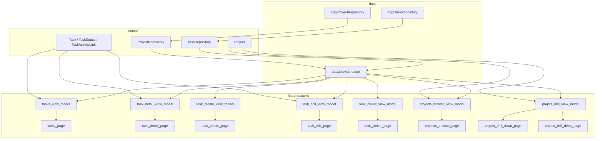

# Tasks & Projects: wire `features/` to real `domain/` + `data/`

Goal: replace the **hard-coded mock data** in `lib/features/tasks/*` and the
projects pages with **real** `Task` / `Project` rows from
`lib/data/tasks/kgql_task_repository.dart` and
`lib/data/projects/kgql_project_repository.dart` through their
`lib/domain/.../*_repository.dart` interfaces — following the same
view-model + provider pattern already used by `features/today/` and
`features/action_*/`.

This plan is **app-side only**; the schema (Alembic 004) and the four
data classes (`Task`, `Project`, repos, mappers, `updateStatus`,
`moveTaskToProject`) already exist. Reference:
[`nx_time_reorg.md`](./nx_time_reorg.md) for layering rules,
[`nested_actions.md`](./nested_actions.md) for the precedent pattern
(features call `ref.read(actionRepositoryProvider)` only).

## Why this is needed

Every file under `lib/features/tasks/` today hard-codes its content:

| File | Mock data |
|---|---|
| `tasks_page.dart` | 5 inline `TaskRowTile`s with literal titles, subtitles, durations |
| `task_detail_page.dart` | Branches on `widget.args.title == 'Draft weekly newsletter' / 'Refactor token validation'` to render different fake bodies; subtasks, notes, time-spent are all literals |
| `task_create_page.dart` | All-stateless; "Create" button is `onPressed: null`; pickers are inert |
| `task_edit_page.dart` | `_fakeField('Refactor token validation')`, fake tags, fake notes; Save just `Navigator.pop` |
| `task_picker_page.dart` | Two `static const` lists `_yesterday` / `_recent`; `Set<int>` of indices is the only state |
| `projects_browse_page.dart` | `static const _rows` of `_ProjectRow` literals |
| `project_drill_down_page.dart` | Hard-coded "Time App / Expense App / Server" sub-projects + literal direct tasks |
| `project_drill_deep_page.dart` | Hard-coded "PCB v3" subtree with fixed indices in `_selected` |

None of these import `package:flutter_riverpod`, none read the existing
`taskRepositoryProvider` / `projectRepositoryProvider`, and none use
the domain `Task` / `Project` types — even though
`mobile/nx_time/test/data/{tasks,projects}/` already proves the
repositories work end-to-end.

## What's already in place (do not redo)

- `lib/domain/tasks/{task.dart, task_repository.dart, task_status.dart}` with
  `TaskStatus { todo, progress, done, skip }`, `linkChildTask`,
  `unlinkChildTask`, `linkProject`, `unlinkProject`, `linkActivity`,
  `unlinkActivity`, plus the just-added `updateStatus(...)`,
  `moveTaskToProject(...)`, and partial `update(task,
  {includeAttributes})`.
- `lib/domain/projects/{project.dart, project_repository.dart}` with
  `listAll`, `getById`, `create({parentProjectId})`, `update`, `delete`,
  `linkChildProject`, `unlinkChildProject`.
- `lib/data/tasks/*` and `lib/data/projects/*` (KGQL impls + mappers +
  schema providers).
- `lib/data/providers.dart` exposes `taskRepositoryProvider`,
  `projectRepositoryProvider`, and the schema providers.
- All three repositories are unit-tested
  (`test/data/tasks/`, `test/data/projects/`,
  `test/data/providers_test.dart`).

The remaining work is purely **`features/` ⇄ `data/providers.dart`**
wiring + per-feature view-models.

## Architecture flow



## Layering rules (from `nx_time_reorg.md`)

- **`features/tasks/*` may import**: `core/`, `domain/tasks/*`,
  `domain/projects/*`, `data/providers.dart`,
  `package:flutter_riverpod`, `package:flutter/...`,
  `package:nx_db/auth.dart`.
- **`features/tasks/*` MUST NOT import**: `data/tasks/*`,
  `data/projects/*`, `package:nx_db/kgql.dart`,
  `package:nx_db/riverpod.dart`, `package:nx_db/nx_db.dart`,
  `package:graphql_flutter`. (View-models reach the data layer through
  `taskRepositoryProvider` / `projectRepositoryProvider` only — never by
  importing the `Kgql*` class directly.)
- **View-models are pure-Dart factories** from `Task` / `Project` to
  display VMs; **providers** hold `AsyncValue` state and call repository
  methods.

## File-level plan

For each page below: the **view-model** is a `ConsumerWidget`-friendly
provider built on `taskRepositoryProvider` / `projectRepositoryProvider`;
the **page** becomes `ConsumerWidget` / `ConsumerStatefulWidget` and
reads it via `ref.watch`. The structure mirrors `features/today/`.

### 1. Shared view-model bag — `features/tasks/task_view_models.dart` (new)

A single file that exposes the providers used across multiple task
pages. Mirrors the role `today_view_model.dart` plays for Today.

- `taskListSummary` (record): `{ total, doneCount, todoCount }` derived
  from a `List<Task>`.
- `final tasksForTodayProvider = FutureProvider<List<Task>>((ref) async
  { final repo = ref.watch(taskRepositoryProvider); return repo.listAll(onDate:
  _today()); });` — pinned-to-today rows.
- `final allTasksProvider = FutureProvider<List<Task>>` — used by the
  picker.
- Pure VM types `TaskRowVm` (title, subtitle, durationLabel, isDone)
  and `taskRowVmsFromTasks(List<Task>, Map<int,String> projectNamesById)`.
- Subtitle is a project breadcrumb: `Nexus App › Time App › Auth`.
  Implementation in §6.

### 2. `tasks_page.dart`

Convert `TasksPage` to `ConsumerWidget`:

- Watch `tasksForTodayProvider`.
- Watch `projectBreadcrumbsProvider` (see §6) for the `subtitle` field.
- Top chips become `taskListSummary` from the resolved list.
- Each row uses the existing `TaskRowTile`; on tap pushes
  `TaskDetailPage(taskId: task.id)` (signature change — see §3).
- Long-press / swipe gestures stay UI-local; status flip on swipe calls
  `ref.read(taskRepositoryProvider).updateStatus(id: t.id, status:
  TaskStatus.done)` then `ref.invalidate(tasksForTodayProvider)`.
- Header date label comes from `core/formatting/date_label.dart` (already
  used by Today), not the literal `'Tasks — Thu, Oct 26'`.
- The `+` (pick) IconButton still pushes `TaskPickerPage`.

### 3. `task_detail_page.dart`

Replace the entire `TaskDetailArgs` payload with `int taskId`:

- New `task_detail_view_model.dart`:
  - `final taskDetailProvider = FutureProvider.family<Task, int>((ref, id)
    async { return ref.watch(taskRepositoryProvider).getById(id); });`
  - Pure mapper `TaskDetailVm taskDetailVmFromTask(Task task,
    Project? project, List<Task> subtasks, Map<int, Action>
    activitiesByLinkRel)` returning labels for the date card,
    progress fraction (= `done` subtasks / total), grouped time-spent
    blocks. This replaces every `_isAuthRefactor` / `_isNewsletter`
    branch.
- `TaskDetailPage` becomes `ConsumerStatefulWidget` keyed by `taskId`:
  - `args.title / subtitle / durationLabel` removed.
  - Status segmented control calls
    `ref.read(taskRepositoryProvider).updateStatus(id: taskId,
    status: newStatus)` and invalidates `taskDetailProvider(taskId)` +
    `tasksForTodayProvider`.
  - Subtask list renders from `task.childTaskIds` (loaded via
    `subtasksOfTaskProvider`, see below); the `+ add subtask` button
    pushes `TaskCreatePage(parentTaskId: taskId)`.
  - "Time spent" section renders `task.linkedActivities` resolved
    against the existing `actionRepositoryProvider` (one
    `actionByIdProvider.family` per link); tap opens
    `ActionDetailPage`. **No** subtype-name branching.
  - "Move to different day" updates `task.date`; "Unpin from today"
    clears it. Both go through `update(updatedTask, includeAttributes:
    true)` and invalidate the day list.
  - "Delete task" calls `delete(taskId)` and pops.
- New `subtasksOfTaskProvider = FutureProvider.family<List<Task>, int>`
  in `task_view_models.dart` that pulls each `id` in
  `parent.childTaskIds` via `getById`. Fan-out via `Future.wait`.

### 4. `task_create_page.dart`

Convert to `ConsumerStatefulWidget`:

- New `task_create_view_model.dart` (pure Dart) with `TaskDraft` (name,
  date, startTime, endTime, tags, notes, parentTaskId, projectId,
  modelTypeId) and validation helpers (`canCreate`, `errorForSave`).
- Constructor params `int? parentTaskId`, `int? projectId` (set by
  picker / drill pages).
- "Parent" tile pushes `ProjectsBrowsePage(mode:
  ProjectsBrowseMode.pickProject)`; the picked `projectId` updates
  the draft.
- Tag chips toggle into `draft.tags` (a `Set<String>`).
- `Create` button enables when `canCreate`; on tap:
  ```dart
  final repo = ref.read(taskRepositoryProvider);
  final newId = await repo.create(
    Task(id: 0, name: draft.name, modelTypeId: taskModelTypeId, ...),
    parentTaskId: widget.parentTaskId,
    projectId: draft.projectId,
  );
  ref.invalidate(tasksForTodayProvider);
  Navigator.of(context).pop(newId);
  ```
- The Task `modelTypeId` comes from `taskSchemaProvider` (already
  exported by `data/providers.dart`) — read once, cache on the draft.

### 5. `task_edit_page.dart`

Convert from "string-blob page" to `ConsumerStatefulWidget` keyed by
`taskId`:

- New `task_edit_view_model.dart` with `TaskEditState` (current draft +
  `Task initial`); validation is shared with `TaskCreate` view-model
  (move common helpers to `task_form_view_model.dart` if useful, mirror
  `action_edit_view_model.dart`).
- Loads via `taskDetailProvider(taskId)`; once the `AsyncValue` resolves,
  prefill the draft.
- "PARENT" tile pushes `ProjectsBrowsePage(mode: pickProject)`. On
  return, **do not** call `update(task)` for the project change — call
  `repo.moveTaskToProject(taskId: t.id, projectId: pickedId)` (the
  helper added in the previous round of fixes).
- Save button calls
  `repo.update(updatedTask, includeAttributes: true)` (full save sends
  status / tags / times — exactly the case the `includeAttributes`
  flag is for). Then invalidate `taskDetailProvider(taskId)` and
  `tasksForTodayProvider`.
- Delete button calls `repo.delete(taskId)`, invalidates the same
  providers, and pops twice (back to list).

### 6. `task_picker_page.dart`

Replace `_yesterday` / `_recent` static lists:

- New `task_picker_view_model.dart` providers:
  - `picker_unfinishedYesterdayProvider = FutureProvider<List<Task>>` —
    `repo.listAll(onDate: yesterday)` filtered to `status != done`.
  - `picker_recentTasksProvider = FutureProvider<List<Task>>` —
    `repo.listAll()` and pick the N most-recently-updated by
    `task.id` (or sort by `updated_at` once exposed by the mapper).
- `Set<int> _selected` → `Set<int> _selectedTaskIds` (real ids).
- The `Done` button posts each selected id back to whatever pushed the
  picker (use `Navigator.pop(context, _selectedTaskIds)`); the
  caller decides what "pin to today" means (e.g. `repo.update(t.copyWith(date:
  today), includeAttributes: true)` once `Task.copyWith` is added — see
  §10).
- "Choose from projects" tile pushes
  `ProjectsBrowsePage(mode: pickTask)`.
- "+ New task" pushes `TaskCreatePage()`; the returned id is added to
  `_selectedTaskIds`.

### 7. `projects_browse_page.dart`

Replace `_rows`:

- New `projects_browse_view_model.dart`:
  - `final allProjectsProvider = FutureProvider<List<Project>>` —
    `repo.listAll()`.
  - Pure helper `List<ProjectBrowseRow> rootProjectsWithCounts(List<Project>
    projects, Map<int,int> taskCountByProjectId)` returns rows for the
    top-level projects (those whose `id` is not anyone's
    `childProjectIds` member) with `subProjectCount`,
    `taskCount`, `subtitle` ("3 sub-projects · 12 tasks", "8 tasks").
  - `taskCountByProjectId` derives from `tasksForTodayProvider`'s
    full-list cousin (`allTasksProvider`); count is `where((t) =>
    t.projectId == p.id).length` plus a recursive walk for
    sub-projects.
- `ProjectsBrowsePage` becomes `ConsumerStatefulWidget` with optional
  `mode: ProjectsBrowseMode { browse, pickProject, pickTask }` and an
  optional `Set<int>? initialSelection` (returned via
  `Navigator.pop` for picker modes).
- Tap on a row with `subProjectCount > 0` pushes
  `ProjectDrillDownPage(projectId: p.id)`; otherwise opens the project
  detail (or returns the pick).

### 8. `project_drill_down_page.dart` and `project_drill_deep_page.dart`

Both are the same page rendered at different depths. Collapse into one
`ProjectDrillPage(projectId, mode)` with a recursive view-model:

- New `project_drill_view_model.dart`:
  - `projectByIdProvider = FutureProvider.family<Project, int>` — `repo.getById(id)`.
  - `subProjectsProvider = FutureProvider.family<List<Project>, int>` —
    `parent.childProjectIds` resolved via `getById` (`Future.wait`).
  - `tasksInProjectProvider = FutureProvider.family<List<Task>, int>` —
    filter `allTasksProvider` by `projectId == id`.
  - `breadcrumbForProjectProvider = FutureProvider.family<List<Project>,
    int>` — walk parents (project repository does not expose parent
    pointer; client builds the inverted index from `allProjects`).
- `ProjectDrillPage`:
  - Header title = `project.name`.
  - "Sub-projects" section renders `sub_projects` rows; tap pushes
    another `ProjectDrillPage(subProject.id, mode)`.
  - "Direct tasks" section renders `tasksInProjectProvider`; tap toggles
    selection in picker mode or opens task detail in browse mode.
  - The deep page's "expand subtasks" UI (`PCB v3 — 2 subtasks`) maps to
    a task with `task.childTaskIds.isNotEmpty`; expanded children come
    from `subtasksOfTaskProvider(parent.id)` (§3).
- Delete the now-obsolete `project_drill_deep_page.dart` after wiring;
  the routing collapses to `ProjectDrillPage(projectId)`.
- `TaskCreateButton` floats in pick mode; pushes
  `TaskCreatePage(parentTaskId: …, projectId: project.id)` so the new
  task is born inside the right project.

### 9. `goals_page.dart` (out of scope, noted)

Goals are not yet in `domain/`. Keep the page mocked until a
`Goal` / `GoalRepository` lands; this plan does not introduce one.

### 10. Domain tweaks needed by features

These are tiny additions to the existing domain types so view-models
don't reach into KGQL:

- `Task.copyWith(...)` — `id?, name?, status?, tags?, date?, startTime?,
  endTime?, projectId?, ...`. Pure Dart; no behavior change.
- `Project.copyWith(...)` — same.
- Optional `int? createdAt` / `updatedAt` on `Task` / `Project` (read
  by mapper from `Model.createdAt` / `Model.updatedAt`) so
  "recently updated" sorts in the picker view-model are honest. May be
  deferred until needed; pickers can sort by `id` for v1.

## Concrete read/write data flow (after wiring)

1. **Open Tasks tab.** `tasks_page.dart` watches
   `tasksForTodayProvider` → `repo.listAll(onDate: today)` →
   `Map<id,Task>`; renders `taskRowVmsFromTasks(...)`.
2. **Tap row.** Push `TaskDetailPage(taskId: id)`; detail page watches
   `taskDetailProvider(id)` and `subtasksOfTaskProvider(id)`.
3. **Toggle status segmented control.** Page calls
   `repo.updateStatus(id: id, status: TaskStatus.done)`; invalidates
   `taskDetailProvider(id)` and `tasksForTodayProvider`. **No
   tag/notes wipe** (uses status-only mutation).
4. **Open Edit.** Page prefills draft from `taskDetailProvider(id)`. Save
   calls `repo.update(updatedTask, includeAttributes: true)`. Project
   change calls `repo.moveTaskToProject(taskId, projectId)`.
5. **Tap "+ add subtask".** Push `TaskCreatePage(parentTaskId: id)`; on
   pop with new id, invalidate `subtasksOfTaskProvider(id)`.
6. **Open Project drill-down.** Page watches
   `projectByIdProvider(id)`, `subProjectsProvider(id)`,
   `tasksInProjectProvider(id)`.
7. **Pick task in picker.** `Navigator.pop(context,
   _selectedTaskIds)`; caller (e.g. Today) decides what to do with
   them.

The pages never see `Model`, `SetModelRequest`, or KGQL attribute
strings — all of that stays in `data/tasks/*` and `data/projects/*`.

## Tests (mirror existing layout)

Per `nx_time_test_reorg.md`, one test file per source file.

- `test/features/tasks/task_view_models_test.dart` — `taskRowVmsFromTasks`
  builds the right `subtitle` breadcrumbs, `taskListSummary` counts.
- `test/features/tasks/task_detail_view_model_test.dart` —
  `taskDetailVmFromTask` for: standalone task, parent task with subtasks
  (progress fraction), task with linked activities (time-spent total).
- `test/features/tasks/task_create_view_model_test.dart` — validation,
  `TaskDraft.canCreate`.
- `test/features/tasks/task_edit_view_model_test.dart` — partial update
  carries `includeAttributes: true`; status-only path uses
  `updateStatus`; project change goes through `moveTaskToProject`.
- `test/features/tasks/task_picker_view_model_test.dart` — fixture
  domain `Task[]` in, expected `(unfinishedYesterday, recent)` out.
- `test/features/tasks/projects_browse_view_model_test.dart` — root
  detection from a list with mixed parents/children; recursive task
  count.
- `test/features/tasks/project_drill_view_model_test.dart` — breadcrumb
  walk over a synthetic project tree.
- `test/widget/tasks_page_test.dart` — pump page with
  `taskRepositoryProvider` overridden by an in-memory fake; tap row →
  detail navigation; swipe row → `updateStatus` invoked exactly once.
- `test/widget/task_detail_page_test.dart` — segmented control change
  invokes `updateStatus`; Edit pushes
  `TaskEditPage(taskId)`; Delete pops + calls `delete`.
- `test/widget/task_create_page_test.dart` — fill name, pick project,
  tap Create → `repo.create(Task(...), projectId: pickedId)` called once.
- `test/widget/task_edit_page_test.dart` — change project → `moveTaskToProject`
  called; change status only → `updateStatus` called; full save →
  `update(task, includeAttributes: true)` called.
- `test/widget/task_picker_page_test.dart` — selecting two rows + Done
  pops with the selected ids.
- `test/widget/projects_browse_page_test.dart` — tap root with
  sub-projects → drill-down; tap leaf → returns `projectId` (in pick
  mode) or opens detail.

A new `test/_support/fake_task_repository.dart` and
`fake_project_repository.dart` in-memory fakes (mirroring the planned
`fake_action_repository.dart`) implement the abstract interfaces so
widget tests do not need a mocked GraphQL client.

## Incremental order

Each step keeps `flutter test` green and the running app launchable.

1. **Add `task_view_models.dart`** (providers + `TaskRowVm`) and convert
   `tasks_page.dart` to consume it. Read path only — no mutations yet.
2. **Add `Task.copyWith` / `Project.copyWith`** (domain change, pure
   Dart).
3. **Wire `task_detail_page.dart`** with `taskDetailProvider(id)` and
   `subtasksOfTaskProvider(id)`. Status segmented control wired to
   `updateStatus`. Delete + Move-to-day wired.
4. **Wire `task_edit_page.dart`** with `taskDetailProvider(id)` for
   prefill; Save uses `update(includeAttributes: true)`; Project change
   uses `moveTaskToProject`.
5. **Wire `task_create_page.dart`** with `task_create_view_model` +
   `repo.create`. Wire `+ add subtask` and project-create flows.
6. **Wire `task_picker_page.dart`** to `picker_*Provider`s and
   `Navigator.pop(ids)`. Update Today to handle the returned ids
   (pin/unpin via `update(includeAttributes: true)` until `pinTask`
   helper is added).
7. **Collapse `project_drill_down_page.dart` +
   `project_drill_deep_page.dart`** into `project_drill_page.dart`;
   wire to `project_drill_view_model`.
8. **Wire `projects_browse_page.dart`** with
   `projects_browse_view_model`; introduce
   `ProjectsBrowseMode { browse, pickProject, pickTask }` and route
   the existing `pickProject` push from create/edit pages here.
9. **Add fakes + widget tests** (`test/_support/fake_task_repository.dart`,
   `test/_support/fake_project_repository.dart`, then per-page widget
   tests).
10. **Add view-model unit tests** (one per `*_view_model.dart`).
11. **Add integration test** `test/integration/tasks_crud_round_trip_integration_test.dart`
    (mirrors the Action round-trip test): create Task → set status →
    move project → delete; assert each step against live KGQL when
    `RUN_NX_TIME_INTEGRATION=true`.
12. **Delete dead mock data** (`_yesterday`, `_recent`, `_rows`,
    `_isAuthRefactor`, etc.) once nothing references them.

After step 12, `lib/features/tasks/**` contains no string literals
that were once "fixture text" — every visible label comes from a
`Task` / `Project` / `TaskStatus` resolved through the existing
`taskRepositoryProvider` / `projectRepositoryProvider`.
